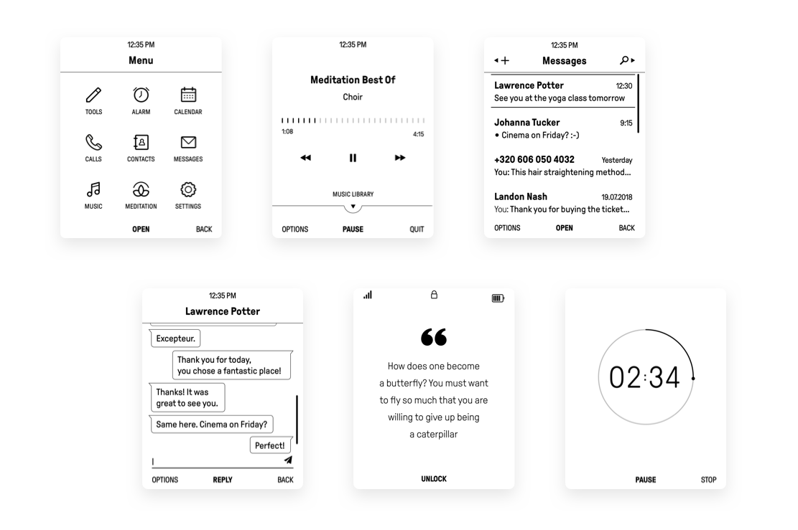

# MuditaOS


[](https://twitter.com/wearemudita)

MuditaOS is a mobile operating system optimized for E Ink displays. Built on FreeRTOS™ with Mudita Pure minimalist phone in mind.



## Key features

- 3 modes (offline, do not disturb, connected) with magnetometer support
- approved contacts list
- threaded messaging with templates, drafts, UTF8 and basic emoji support
- audio player supporting MP3, WAV, FLAC formats and indexed ID3 Tags
- meditation app
- calendar app
- calculator
- alarm clock
- contacts and calendar synchronization via Mudita Center desktop app 
- flashlight
- user interface optimized for E Ink displays with frontlight support
- dark mode
- Bluetooth headset connectivity with A2DP (Advanced Audio Distribution Profile) and HSP (Headset Profile) support
- Passive Dual SIM support
- USB-C Fast Charging
- VoLTE and internet tethering support
- HAL (Hardware Abstraction Layer) between the hardware and the OS
- system manager that restores the system after switching on the device or performs the initial start-up
- application manager for managing application lifecycle 
- SQLite database for storing contacts and notes
- VFS (Virtual File System) + file storage based on `lwext4`
- MTP (Media Transfer Protocol) support

## Table of contents

* [Quickstart](#Quickstart)
* [Contributing](#Contributing)
   * [Discussions](#Discussions)
   * [Reporting issues and feature requests](#Reporting-bugs-and-feature-requests)
   * [Internationalization](#Internationalization)
   * [Development workflow](#Development-workflow)
* [Documentation](#documentation)
   * [How to generate documentation using Doxygen](#How-to-generate-documentation-using-Doxygen)    
* [License](#license)

## Quickstart

You can quickstart the project by going through one of the following guides:

- [Quickstart using Docker](./doc/quickstart.md#quickstart-using-docker)
- [Building your own Docker image](./doc/quickstart.md#building-your-own-docker-image)
- [Quickstart in your local environment](./doc/quickstart.md#quickstart-in-your-local-environment)
- [Longstart](./doc/quickstart.md#longstart)
- [Super dirty quickstart on Linux](./doc/quickstart.md#super-dirty-quickstart-on-linux)
- [Super dirty quickstart with unit tests](./doc/quickstart.md#super-dirty-quickstart-with-unit-tests)
- [Super dirty quickstart on the phone](./doc/quickstart.md#super-dirty-quickstart-on-the-phone)
- [Preparing packages](./doc/quickstart.md#preparing-packages)
- [Logging engine](./module-utils/log/doc/logging_engine.md)

## Contributing

Pull requests are welcome. Please follow the guidelines in the ["Contributing to MuditaOS"](./CONTRIBUTING.md) article. Before contributing or starting a discussion, please make sure that you read our [Code of Conduct](./CODE_OF_CONDUCT.md).

### Discussions

For general questions and ideas regarding MuditaOS please post in the [“MuditaOS” section on Mudita Forum](https://forum.mudita.com/c/MuditaOS/). Please explore all existing posts to make sure you’re not posting about an issue that has already been discussed.

### Reporting bugs and feature requests

You can report bugs and feature requests on [GitHub](https://github.com/mudita/MuditaOS/issues). This is also a good place to discuss architecture decisions and things that aren’t yet covered by the documentation. Please refer to the ["Contributing to MuditaOS"](./CONTRIBUTING.md) article for more details.

### Internationalization

If you want to start localizing MuditaOS interface please start from [the "Internationalization" article](./doc/i18n.md).

### Development workflow

When contributing code or documentation changes please follow the guidleines inside the ["Development workflow"](./doc/development_workflow.md) article.

## Documentation

For everything you need to kickstart your development environment please go to the [Documentation](./doc/README.md) on GitHub.

A fully detailed documentation can be build locally using [Doxygen](https://www.doxygen.nl/index.html).

### How to generate documentation using Doxygen

You can build code documentation with the following command, regarding the product:

```bash
./configure (PurePhone|BellHybrid) linux Debug
cd build-(PurePhone|BellHybrid)-linux-Debug
make doc
```
If you prefer to build documentation always with `all` target instead, configure `cmake`
with `BUILD_DOC_WITH_ALL` option set to `ON`, e.g.:

```bash
./configure <product> <target> <build_type> -DBUILD_DOC_WITH_ALL=ON
```

Documentation is generated in the `doc/html` subdirectory of the build directory. To view it open `index.html` using a web browser, e.g.:

```bash
firefox build-<target>-<build_type>/doc/html/index.html
```

## Changelog

The [MuditaOS changelog](./changelog.md) is regularly updated by the core development team.

## License
MuditaOS is licensed under [GNU GPLv3](https://choosealicense.com/licenses/gpl-3.0/).
