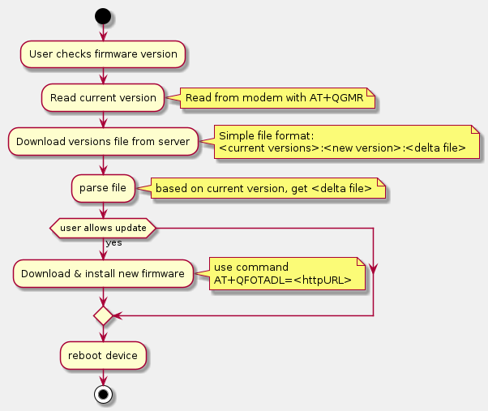
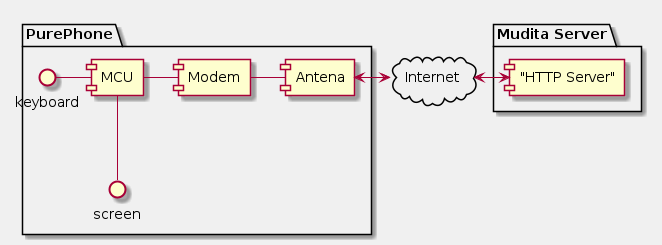
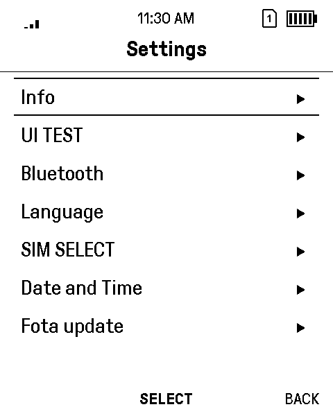

# Verizon FOTA Certification notes

FOTA is initialized manually by device user from system menu.
Application starts data connection using predefined APN, then from
Mudita server, downloads text file containing map of available updates.
Application reads current version of firmware from modem, and checks if there are any updates.

If updates are available presents new firmware version to the user, if user would like to starts update.

If user proceeds with update, from the map file, downloaded in previous steps, application
generates url to the update file, and passes its to modem initiating firmware update.

Brief description of the process done by modem itself
download delta file
check signatures
update firmware
reboot modem.

Finally PurePhone is rebooted.

## Brief Description of the FOTA implementation

## Tester Info

* Tester's Name: Radosław Wicik
* Tester's Email: radoslaw.wicik@mudita.com
* Test Date(s): 2020-06-19

## Uniit Under Test
* IMEI: 867698041113450
* HW Version: T4
* SW Version before FOTA: EG25GGBR07A07M2G_01.003.01.003
* SW Version after FOTA:  EG25GGBR07A08M2G_01.001.01.001

## FOTA verification test setup diagram

### Architecture diagram for FOTA implementation (show device, network and server implementation)

### Logs/Screen captures

---

---

---

---

---

---

---

---

---

---

---

---

---

