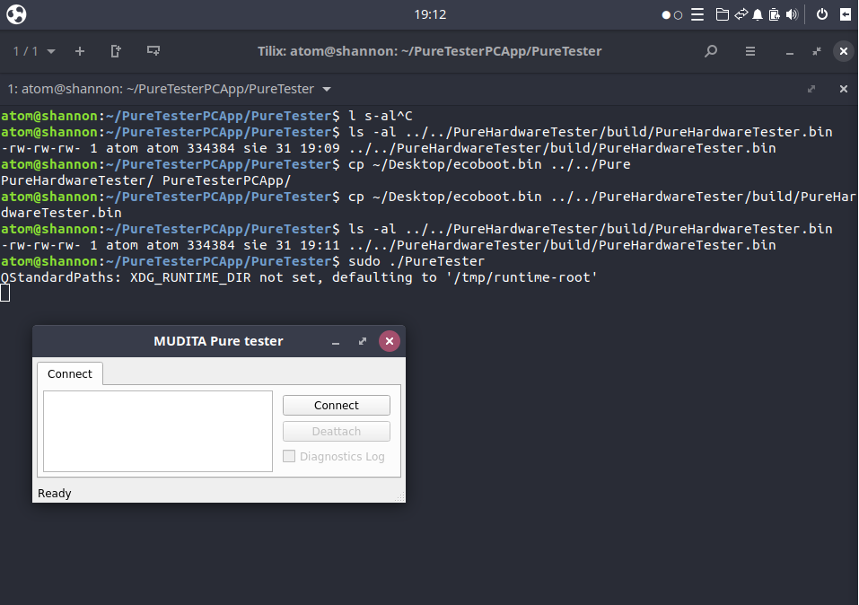
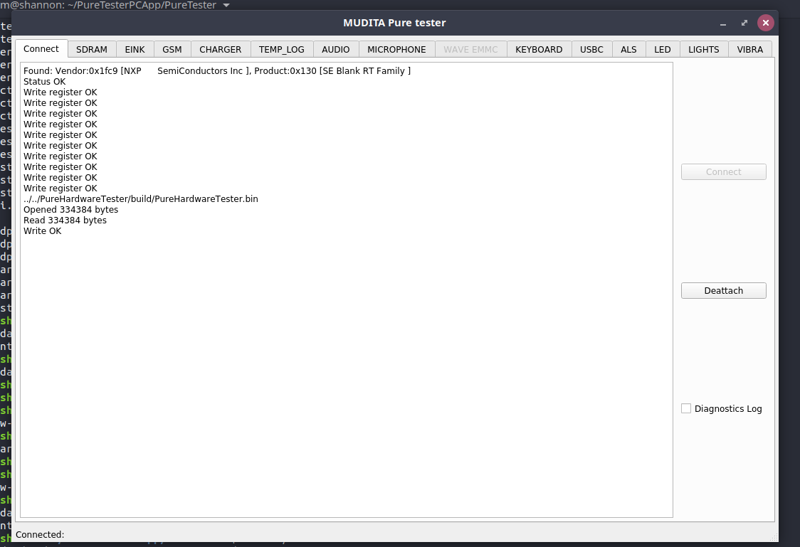

To start you need to obtain a working version of the PureTesterPCApp.

The repository for this application is at: https://github.com/mudita/PureTesterPCApp
it's qt based so to build it you'll need a couple of extra packages (names for debian
bases linux distro):

`# apt-get install qt5-qmake libqt5serialport5-dev libudev-dev`

clone the repo and build it using qmake and make.

`# git clone git@github.com:mudita/PureTesterPCApp.git`

this application is maintained byt the Electronics team of Mudita and they are
responsible for this repo in case on any errors please consult them for help.

By default this app looks for a binary file to load to memory of the phone, the
path it uses is ../../PureHardwareTester/build/PureHardwareTester.bin relative to
the binary. You can either make those directories and use them or recompile the program
with a different path (connecttab.cpp line #164)

(below we assume default compile with DEVELOPER_CASE enabled)
Create the build directory:

`# mkdir -p ../../PureHardwareTester/build`

Download a copy of ecoboot.bin from github
https://github.com/mudita/ecoboot/releases/tag/1.0.4

replace the file PureHardwareTester.bin as defined in the PureTesterPCApp
with ecoboot.bin

`# cp ecoboot.bin ../../PureHardwareTester/build/PureHardwareTester.bin`

Now run the app as root (this is important running it as a normal user might
fail if you are not in proper groups)

`# sudo ./PureTester`

You should see a screen like this:

Now hold the middle joystick button on the phone (as usual when you want to
enter the bootloader) and click connect on the app, you should ge a normal
bootloader screen on the phone and an output from the app like this:

After this press 4 on the phone and it should enter normal USB-MSC mode.

If the phone is clean it will only report one disk with no partitions, if that's
the case you should follow p5: https://github.com/mudita/PurePhone/blob/master/doc/boot_and_update.md
this will tell you how to flash the phone with new software.

You also need to flash some version of ecoboot.bin, to do that after flashing the
phone repeat this procedure and enter ecoboot in USB-MSC mode once again, now
copy ecoboot.bin to the root of the first disk **PUREOS** and safetly remove
the disk from the OS using your file manager, you can also do it using command
line (assuming /dev/sda is the PURE usb disk)

`# udisksctl power-off -b /dev/sda`

this should start the ecoboot ubdate process.

If one of the steps fails, you can see what's going on by connectint to the
serial port of the JLink device (/dev/ttyAMA*), all information from the bootloader
when it runs and is trying to update itself are logged there.

## In case of failure

If the above method does not work, you will have to use JLink and the Ozone
debugger. First connect the JLink device to the phone and download the needed
drivers and Ozone. Clone the D1 FLash loader repo to be used in Ozone from:

https://github.com/mudita/D1_eMMC_FlashLoader

also download the binary release for D1 from the releases page of the project. With
the binary you don't need to rebuild the project (download the .axf file)
`https://github.com/mudita/D1_eMMC_FlashLoader/releases

in the cloned project directory create a directory Debug and plase the .axf file
in it

`# mkdir Debug`

`# cp D1_eMMC_FlashLoader.axf Debug/`

In ozone open the project using the FLDebug.jdebug file, then connect do the device
and run the code. The phone should switch to USB storage mode and you can now access
the disk. It also updates the bootloader code the same way as ecoboot does, just plase
a current ecoboot.bin file in the root directory of the first partition and eject
the disk using your file manager or using cli (assuming your phones is /dev/sda):

`# udisksctl power-off -b /dev/sda`
