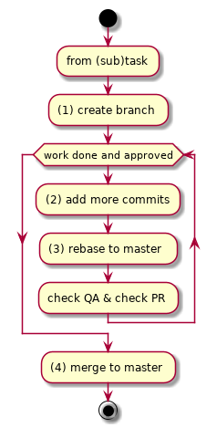

# development workflow



Additional info, one feature at the time:
* 1: create branch - branch name `EGD-<NUM>` i.e. `EGD-123`
* 2: add more commits - each commit should have in short message `[EGD-<NUM>] short message`
    * for WIP and FIX - this should be too added in commit message `[EGD-<NUM>]` i.e
        * `[WIP] [EGD-123] Progress on progressbar`
        * `[FIX] [EGD-123] Progress on progressbar`
* 2.5: Add proper PR description to changelog
* 3: rebase to master
    * When updating own branch one should rather rebase (which moves own commits on top) then merge (which puts changes by dates as it is)
    * This will provide better history and git conflict solving

After PR - feature branch is frozen in development (only fixes)
If you need further development - fork and update this fork to PR till its closed (after closing to master)

**If you need any assistance on how to do it @Adam will be glad to show you and answer questions in scope of his ability.**

[What is rebase and how - by atlassian](https://www.atlassian.com/git/tutorials/merging-vs-rebasing)
[Simple case flow example](https://makandracards.com/makandra/36003-recommended-git-workflow-for-feature-branches)

# Cleaning mess on branch prior to PR and work on branch 

* when you have mixed new fetures with PR features use `git rebase to HEAD~N` to move commits in proper order

# PR review who, how and why

* Author creates PR
* We daily check if there are PR's requested with fresh changes
* Author fixes all `blocking` comments on PR, as described above
    * in case of disagreement - talk with commenter (comments)
    * in case of stale disagreement - parties ask for lead decision
* When everything is ok, and there are minimum 2 reviews approved author can select `rebase and merge` and do it

# Git rebase commits and how it works

*Git rebase works different than Git merge.*

With rebase, you update your commits one by one. So:
```
git rebase origin/master  # will update your commits one by one to master.
```

To update it to top fresh version of master:
```
git fetch                 # update remote branches on your pc
git rebase origin/master  # update branch you are at to origin/master
```

*Git rebase works on actual branch copy*

Rebase changes your commit history (moves them on top) this means two things:  
* when you did a lot of changes in lot of places - either `git push` your branch on server, or make it's copy  
* when you are happy of rebase results - you will need to push your branch with force to server - as you changed it's history (updated it)  

Minimal commands:
```
git fetch                                             # update all remote branches  
git status                                            # check if there are not changes dangling, or waiting to commit, no merge in progress etc  
git push origin your_branch_name:your_branch_name     # push your branch to server  
git rebase origin/master                              # update your local branch to origin master  
# while rebase not done
git mergetool                                         # if rebase didn't succeed it will ask to merge each commit it can't fast forward on top, othervise it won't happen  
git rebase --continue                                 # update of this commit to master is done, proceed  
git status                                            # when done - check that you have really done it  
# endwhile  
# rebuild repository and check if your changes are intact
```

If there was something that broke your chanes you can now either:
* fix it in next commit
* try rebase again with:
    * `git reset origi/your_branch_name --hard`

If your rebase succeed:
* `git push origin your_branch_name:your_branch_name`

*Please remember:*
* Rebase changes history - don't rebase branches other people are working on
    * It's doable all right, but if you don't know the tool that well please check first how
* Always rebase your feature branches to origin master

# How to change some commit somewhere in history of my PR branch I'm ashamed

```
git log -S 'stupid log I added'     # search in history when some text was added
git rebase COMMIT_SHA~ -i           # interractive rebase to commit sha I found in git log -S
# select option edit in interactive mode on commit that's wrong
# fix file that's wrong
git add FIXED_FILE                  # add your fixups (i.e. removal of dumb log)
git rebase --continue               # continue with rebase
```

If you added file that you didn't want you can use:
```
# instead fixing this file manually
git reset HEAD~ --hard
# or if you want to keep part of changes, and add changes you want to add:
git reset HEAD~
# than:
git rebase --continue
```

# PS: good git browser will do it all for you, if you can do it all in git-kraken or sourcetree!*
