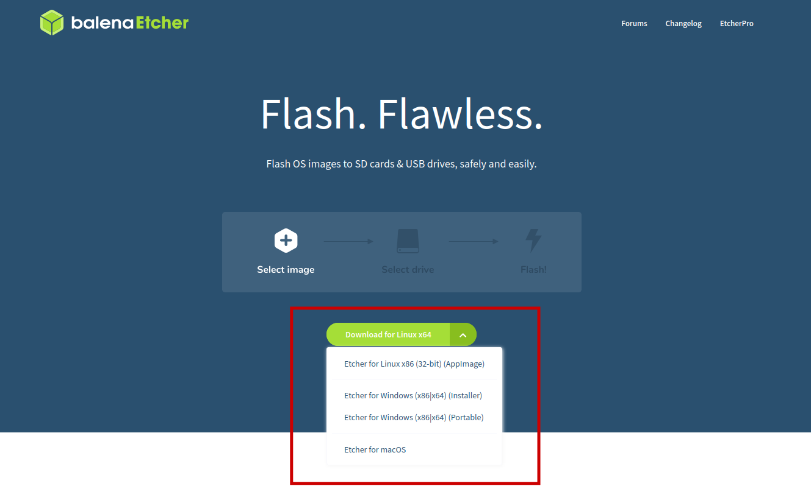
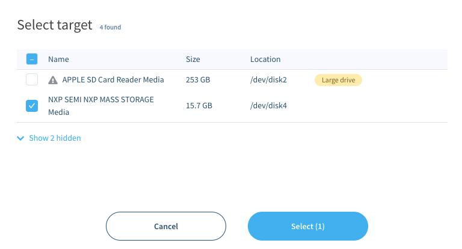
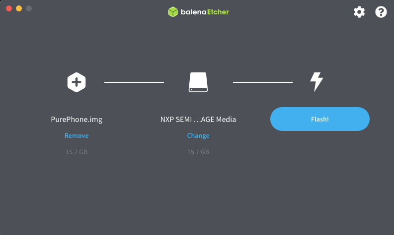
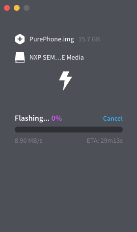

# Windows and macOS - flashing Pure with image

1. Run Mudita Pure in USB MSC (Mass Storage Class) mode

- Switch off the phone and remove the battery (you won't need it for flashing)
- hold the center button (selection)
- plug in the USB cable
- wait while the text menu scrolls from the bottom
- release the center button
- choose `USB MSC mode`

2. Flashing on Windows and macOS

- download [balenaEtcher](https://www.balena.io/etcher/) from the website for your operating system. The downloaded file is either called `balenaEtcher-Setup-{version}.exe` (for Windows) or `balenaEtcher-{version}.dmg` (for MacOS) and will be used to install the application on your computer.

- install the balenaEtcher application.
- download the MuditaOS image you want to use and extract it locally. 

**Note: unzipped image has 16 GB**

The `.xz` image is compressed twice using both `tar` and `xz`. Some unpackers will only extract `.tar` which should be extracted again to get a `PurePhone.img` file.

- Run balenaEtcher application and choose `Flash from file` and the ISO image as the image type. Load unzipped image onto the target device. It might look something like this:

- press `Flash!`` and confirm if asked for the superuser password.
- wait for the flashing to complete:

- reboot the phone.

Note: In order to reboot the phone, do the following:
* Eject the drive from your Operating System (either using `Safely remove` on Windows, or `Eject` on Linux), or
* Reboot the phone by disconnecting it from the power supply (USB cable and battery) and connecting it to the relevant power source again.

