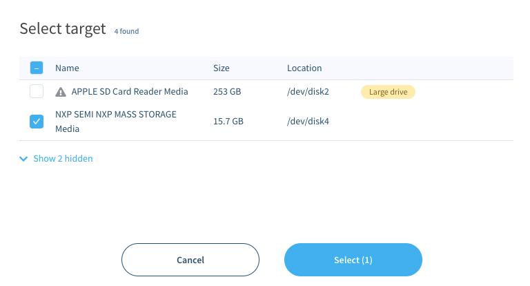
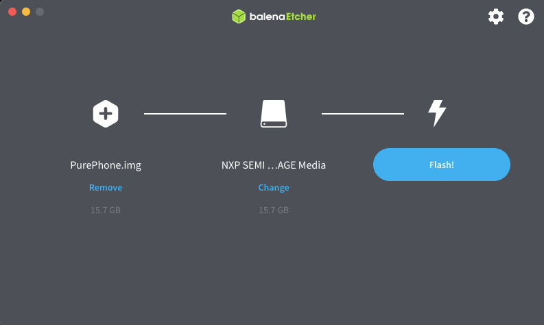
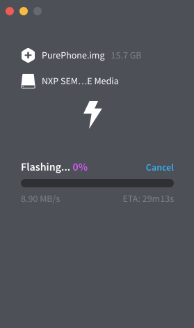

# Windows and macOS - flashing Pure with image

1. Run Mudita Pure in USB MSC (Mass Storage Class) mode

- switch off the phone and remove the battery (you won't need it for flashing)
- hold the center button (selection)
- plug in the USB cable
- wait while the text scrolls from the bottom
- release the center button
- press the `4` key

2. Flashing on Windows and macOS

- download [balenaEtcher](https://www.balena.io/etcher/) for your operating system.
- download the MuditaOS image you want to use and extract it locally. 

**Note: unzipped image has 16 GB**

The `.xz` image is compressed twice using both `tar` and `xz`. Some unpackers will only extract `.tar` which should be extracted again to get a `PurePhone.img` file.

- run balenaEtcher and choose the ISO image as the image type. Load unzipped image. It might look something like this:

- press `Flash!`` and confirm if asked for the superuser password.
- wait for the flashing to complete:

- reboot the phone by disconnecting the USB cable and putting in the battery 👌🏻
