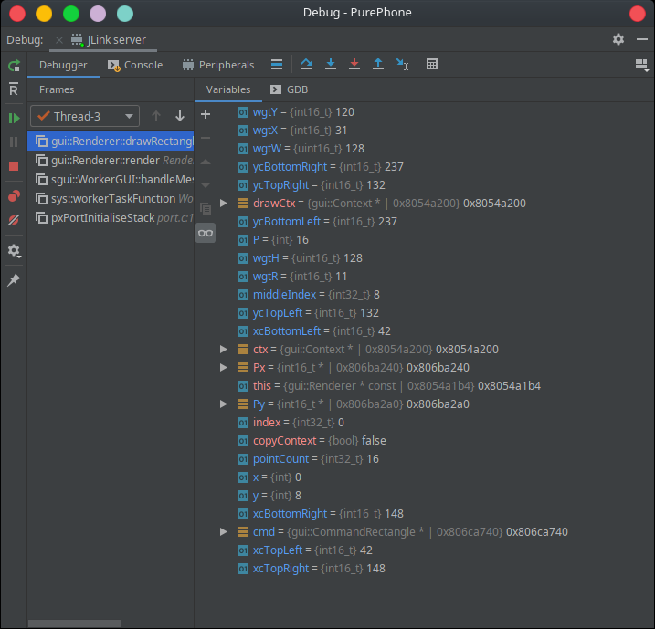

Setting up an integrated development environment
================================================
- [Setting up in Eclipse](#setting-up-in-eclipse)
- [Setting up in CLion](#setting-up-in-clion)
- [Setting up in QtCreator](#setting-up-in-qtcreator)
- [Additional info](#additional-info)
    + [Prevent Git from suggesting commits](#prevent-git-from-suggesting-commits)
    + [Seperate build folders](#separate-build-folders)

## Setting up in Eclipse

To run the project in Eclipse:

1. Run `cmake` to create build directory. Create inside build `sys` folder and copy all assets to it (e.g path for font: `sys/assets/fonts/gt_pressura_regular_16.mpf`). A faster way to do this is to run `./rebuild script` command in the main directory.

2. Open project properties and in tab `C/C++ Build`->`Builder Settings` set build directory to: `${workspace_loc:/PurePhone}/build`

3. Create debug configuration (right click on project and select `Debug as: local c/c++ application`)

4. Open new debug configuration and in `Arguments` tab set `Working directory` to `${workspace_loc:PurePhone/build}`

5. In `Debugger` tab set `GDB command file` to `${project_loc}/.gdbinit`

## Setting up in CLion

### Setting up Toolchains

1. Open settings (CTRL+ALT+S)
2. Go to `Build, Execution, Deployment` -> `Toolchain`
3. Add new toolchains for Linux and RT1051 (ALT+Ins) of `System` type
    - Name: Linux
        - CMake should be autodetected - if not, run `which cmake`
        - Select appropriate `gdb`
        - for x86 it's usually `/usr/bin/gdb`

    - Name: RT1051
        - CMake should be autodetected - if not, run `which cmake`
        - Select appropriate `gdb`
        - for RT1051 it's usually `~/gcc-arm-eabi…`

### Building configurations

1. Open settings (CTRL+ALT+S)
2. Go to `Build, Execution, Deployment` -> `CMake`
3. Add new CMake Profile (ALT+Ins)
  - Name: Linux
  - Build type: Debug
  - CMake options:
    ```
    -DCMAKE_EXPORT_COMPILE_COMMANDS=True
    -DCMAKE_TOOLCHAIN_FILE=../Target_Linux.cmake 
    -DCMAKE_EXPORT_COMPILE_COMMANDS=1
    ```
  - Select appropriate Toolchain created above
  - Generation path: `build-linux`
  - Build options: `-j8`

**Note:** you can set Generation path to `build` if you don't plan to configure CLion for RT1051.

4. Add new CMake Profile (ALT+Ins)
  - Name: rt1051
  - Build type: Debug
  - CMake options:
    ```
    -DCMAKE_EXPORT_COMPILE_COMMANDS=True
    -DCMAKE_TOOLCHAIN_FILE=../Target_RT1051.cmake
    -DCMAKE_EXPORT_COMPILE_COMMANDS=1 ../
    ```
  - Select appropriate Toolchain created above
  - Generation path: `build-rt1051`
  - build options: `-j8`

### Running/debugging
#### Linux configuration

**Important**
Before 1st run, execute `Build All in 'Linux'` to generate the `service_renderer` utility.

Go to `Edit Configurations…` (double shift) and select `CMakeApplication` -> `PurePhone`. This is your configuration for Linux executable.
In `Working directory` append `/build`.

Now you can run/debug this configuration.

#### RT1051 configuration

Use file `.idea/JLink_server.xml` to setup IDE. It's already in the project folder, so CLion should pick it up automatically.

You'll also need `.gdbinit-1051-clion` file modified for CLion ([source](https://stackoverflow.com/questions/39810593/gdb-monitor-commands-in-clion)).

This file needs to be present in `$HOME/.gdbinit`. 

Try this command to input it there `ln -s %project_root%/.gdbinit-1051-clion ~/.gdbinit`. 

#### Workflow

In the debuging configuration dropdown select a pair of **<exec>** and **<toolchn>** (**[ \<exec\> | \<toolchn\> \]**):
- **\[PurePhone | Linux\]** for run/debug on desktop (Linux)
- **\[JLink server | RT1051\]** for debug on embedded (RT1051)

**Note:** RT1051 doesn't have *run* configuration. Only debug is available.



#### Running target
It's possible to see logs from a RT1051 booted from eMMC and not from RAM. 
To do so select `JLink server (no upload)` configuration.

Open `JLinkRTTClient` in a separate terminal.

**Note:** remember to stop this debug session when you want to switch to regular JLink server (with upload), otherwise they will collide.

To properly debug a running target you need to reset it first. Attaching to an already running target won't work.

### Separate build folders in CLion

To build separately for each architecture you need to:

- Open settings (CTRL+ALT+S)
- Goto to `Build, Execution, Deployment` -> `CMake`
- Select `Linux`
- Add a variable to `Environment`: `PROJECT_BUILD_DIRECTORY=build-linux`
- Change `Generation Path` to: `build-linux`

and 

- Open settings (CTRL+ALT+S)
- Go to `Build, Execution, Deployment` -> `CMake`
- Select `rt1051`
- Add a variable to `Environment`: `PROJECT_BUILD_DIRECTORY=build-rt1051`
- Change `Generation Path` to: `build-rt1051`

After the above steps: 
- Change run/debug `Working directory` for Linux configuration. (`Edit configurations…` -> `PurePhone`)
- Change `Working directory` from `…/PurePhone/build` to `…PurePhone/build-linux`

## Setting up in QtCreator

- Install `QtCreator` version `3.5` or later
- Install `CMake` version `3.19.5` or later
- It is highly recommended that you install `Ninja` as it will radically decrease rebuild times.
- [Ensure `CMake` is setup in `QtCreator`](https://doc.qt.io/qtcreator/creator-project-cmake.html)

### Project configurations

- Go to `File` -> `Open File or Project...` and select the `CMakeLists.txt` project file.
- After selecting the kits you wish to use select the `Projects` button on the left bar.
- Ensure `PureOS` is the active project.
- Select `Build` under the name of the kit you wish to configure.
- At the top of the `Build Settings` page, select the build configuration you want to modify.
- In the `Initial CMake parameters:` field, _append_ one of the following:

    **For Linux Target:**
    ```
    -DCMAKE_TOOLCHAIN_FILE:STRING=Target_Linux.cmake
    -DPRODUCT:STRING=PurePhone
    ```
    **For RT1051 Target:**
    ```
    -DCMAKE_TOOLCHAIN_FILE:STRING=Target_RT1051.cmake
    -DPRODUCT:STRING=PurePhone
    ```
- Build project normally.

## Additional info

### Prevent git from suggesting commits

If you want to prevent git from suggesting you to commit changes to the configuration files where we place local paths and other data, please cast following spell: `git update-index --skip-worktree env.cmake`

This will tell git to ignore local changes to the file. In above example we are preventing commiting changes to file called `env.cmake` where you probably want to place local path to Arm's toolchain.

### Separate build folders

By default both targets (Linux & RT1051) are build into the same destination (the `build` folder).

With this configuration you have to run `./rebuild.sh` every time you want to change target. Also you can't debug simultaneously Linux and RT1051.

There is an option for both targets to have separate build folders.

To enable it, set the environmental variable `SEPARATE_BUILDS` to any value (e.g. `=1`) inside `./rebuild.sh`.

**Examples**:
`env SEPARATE_BUILDS=1 ./rebuild.sh rt1051` will cause RT1051 to be build into a separate `build-rt1051` folder.

By default `./rebuild.sh rt1051` builds into `build`

You can build only the Linux build inside its separate folder, and leave RT1051 in place, thus maintain compatibility with `./run.sh`.

```
> env SEPARATE_BUILDS=1 ./rebuild.sh linux
> cd build-linux; ./PurePhone.elf
> cd ..
> ./rebuild.sh rt1051   # will be built to the default `build` folder
> StartJLinkServer.sh &
> ./run.sh
```

Guide for CLion has a dedicated section entitled ["Separate build folders in CLion"](#separate-build-folders-in-clion).

#### How it works

By default `./rebuild.sh` copies assets and generates CMakes to generic `build`.
`SEPARATE_BUILDS=1` overrides it.

Then comes CMake. CMake uses persistent (CACHED) variable `PROJECT_BUILD_DIRECTORY` to build every module.
You can set it either in `cmake-gui` or by passing environmental variable to `cmake`.

This works like a toggle. You don't have to specify it every time. The new build path gets embedded into every `CMakeCache.txt`, so any following `make` command doesn't require any extra arguments.
