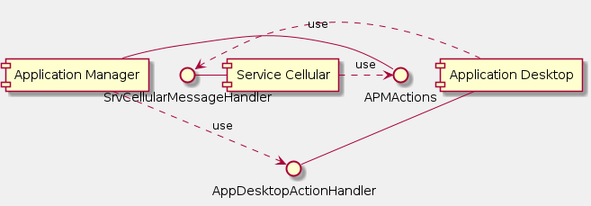
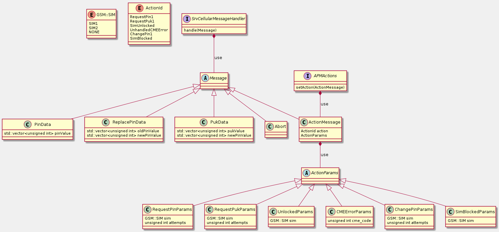
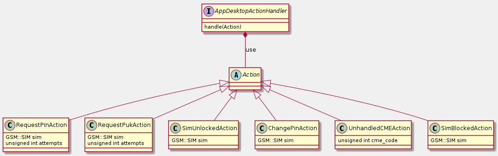
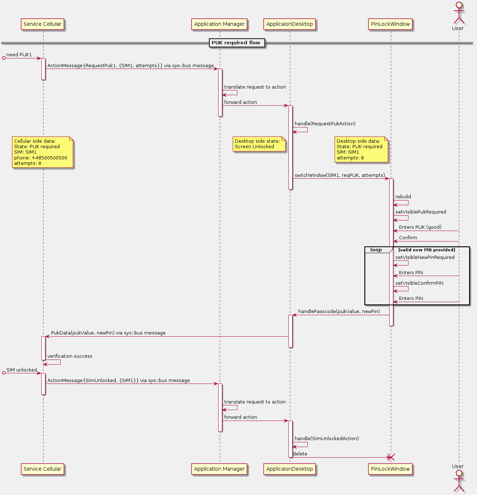
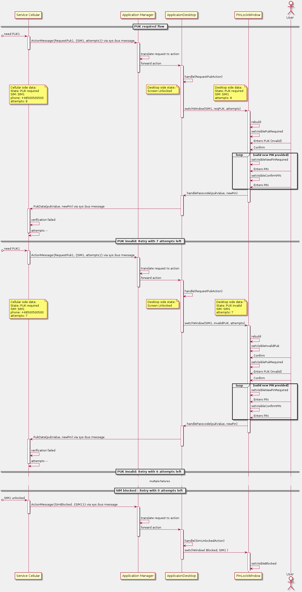
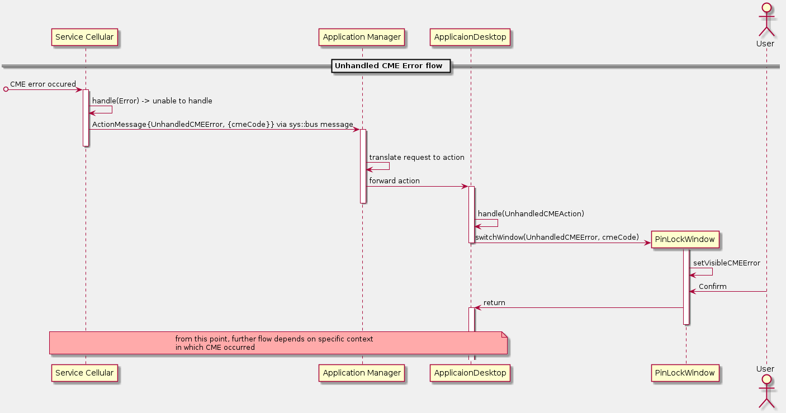
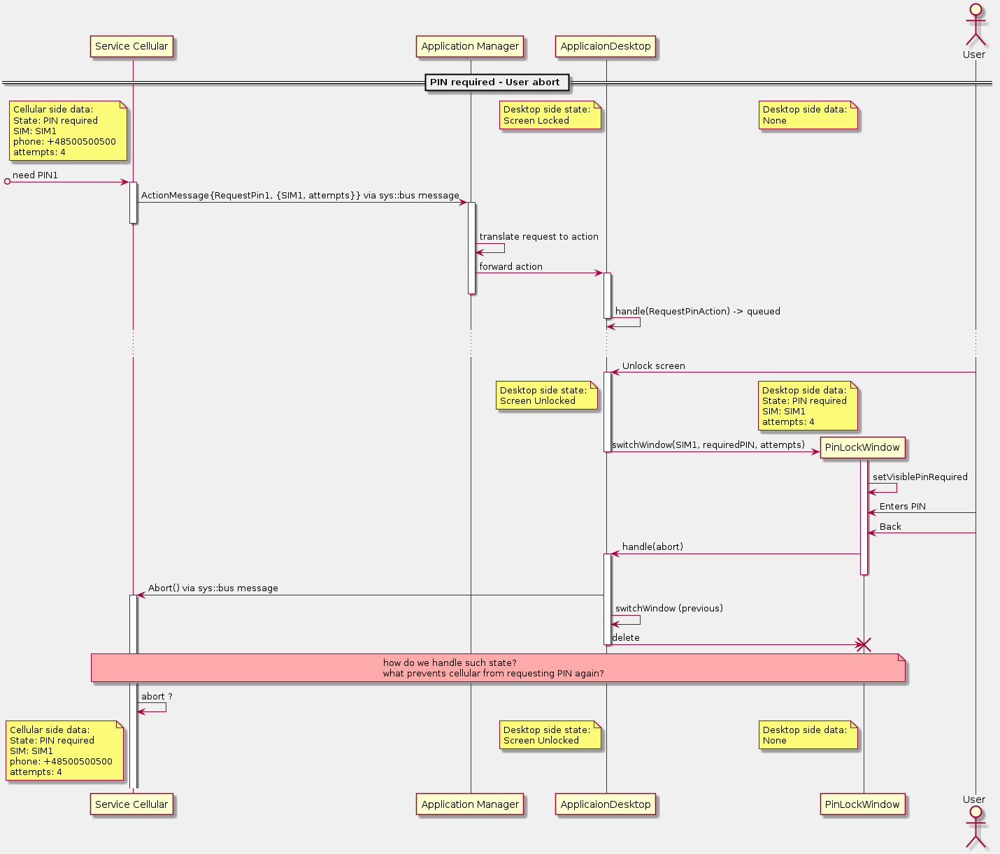
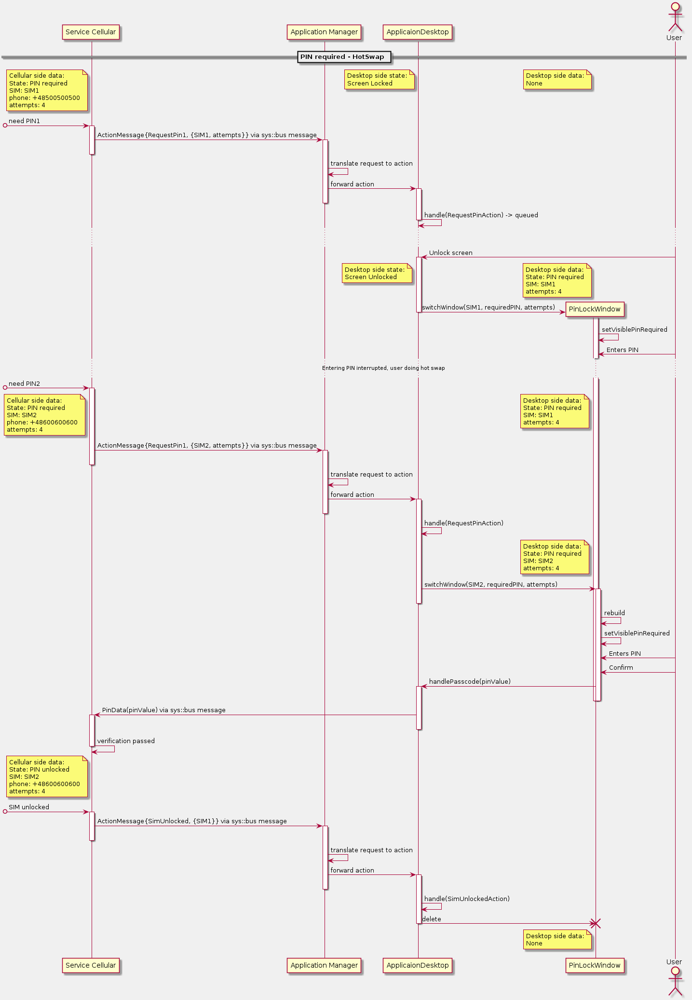

#Auto-locking mechanism
PurePhone screen can be locked automatically due to user inactivity.  
The Auto-locking mechanism is controlled by 'gs_auto_lock_time' parameter settings stored in database.
Initial value for 'gs_auto_lock_time' (units for value is ms) can be changed in image/user/db/settings_v2_002.sql.
Values lower than 1000 (<1s) are treated as 0 and thus disable auto-locking.
Auto lock action is performed only if following conditions are met:
 - tethering is off
 - focused application does not prevent auto-locking

#SIM PIN flow

The PIN/PUK-related flow between SIM card and `PurePhone` `User` is directed by three main entities:
1. `Service Cellular` that is responsible for handling modem interactions in this context     
2. `ApplicationsManager` that is responsible for `ApplicationDesktop` management and reliable messaging in the `Service->Application` direction in this context. 
3. `ApplicationDesktop` that is responsible for `PurePhone<->User` interactions in this context 

Following document focus mainly on (above listed) entities interactions and flow. Occasionally minimal interaction with other entities (such as `User` or `modem`) is outlined.  

## Functional Decomposition

Basic interactions can be captured by following interfaces:
1. `Service Cellular` realizes 
    * `SrvCellularMessageHandler`
2. `ApplicationsManager` realizes
    * `APMActions`
3. `ApplicationDesktop` realizes
    * `AppDesktopActionHandler`
    

## General flow overview

Each flow in this context consists of single action originating in `ServiceCellular` send with `ApplicationsManager` being middle-party that is responsible for appropriate action setup and optional feedback message sent directly from `ApplicationDesktop` to `ServiceCellular` via `sys::Bus` service.

## PIN flow
### PIN required basic flow:

### PIN flow with multiple failures leading to PUK

## PUK flow
### PUK required basic flow:

### PUK flow with multiple failures leading to PUK

## Unhandled CME Errors

## Other flow cases to further analysis

### Flow with user abort

### Flow with hot-swap

### Flow with potential race

