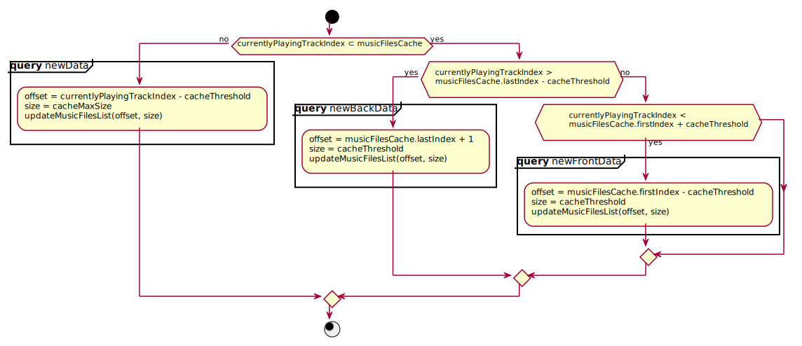
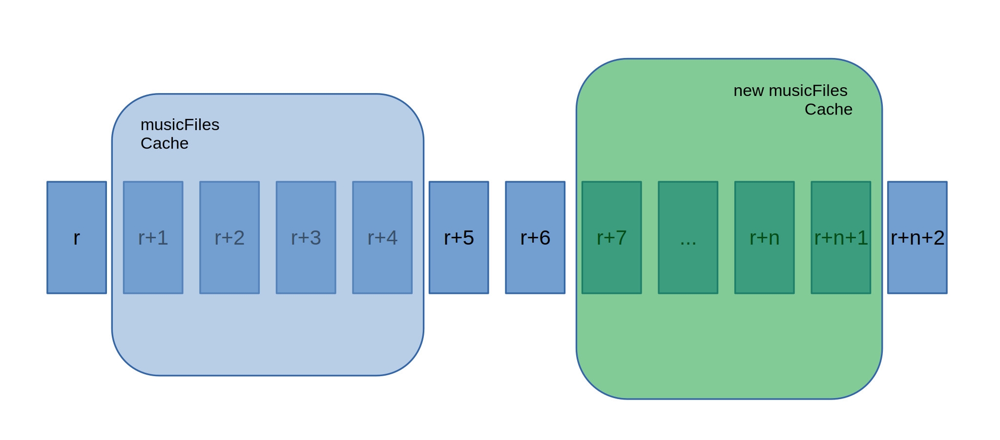
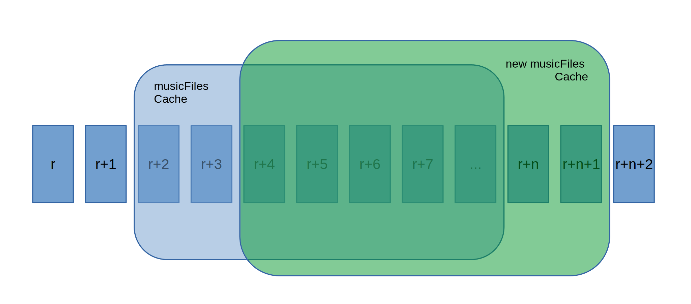
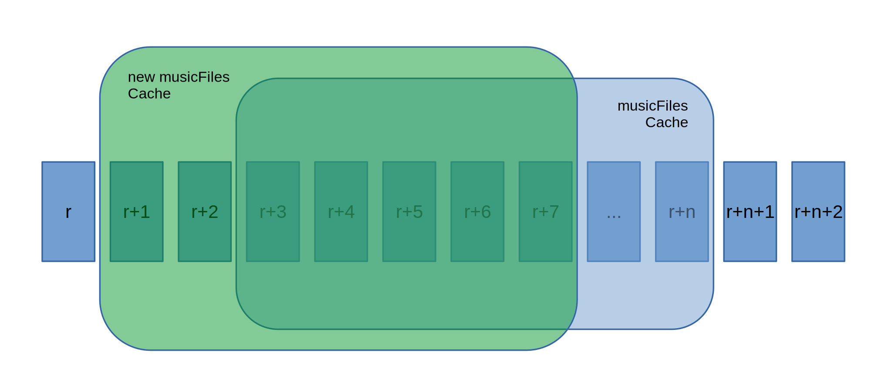

# Songs Repository

In order for the music player to work properly, especially asking for the next and previous track from the list, we have to internally keep the list of currently processed tracks. 

## Music list cache memory

The cache for musicFiles contains a list of songs currently being processed. It is always updated in such a way that it is possible to get the next and previous track.

## Sequence flow 

## UpdateRepository

**Queries:**

**Receiving new records:**

1. newData
     - when new data is received, the musicFiles cache is completely overwritten 

2. newBackData
     - when we receive newBackData, new records are added to the musicFiles cache and records from the top of the list are deleted 

3. newFrontData
     - when we receive newFrontData, new records are added at the beginning of the musicFiles cache and records from the end of the list are deleted 

