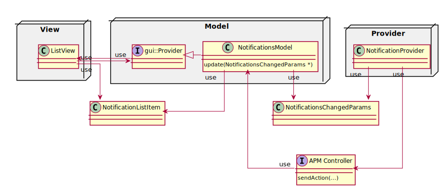
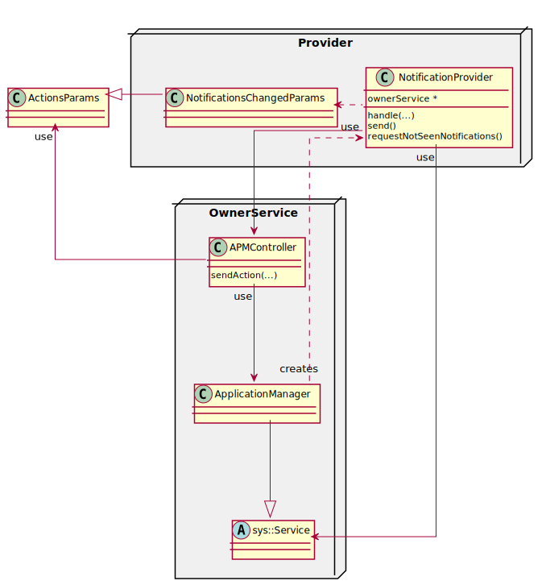
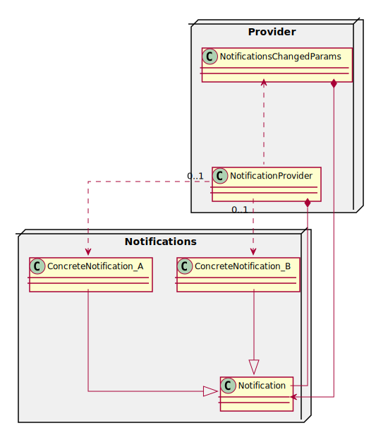
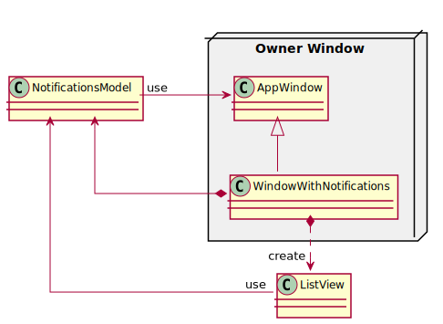
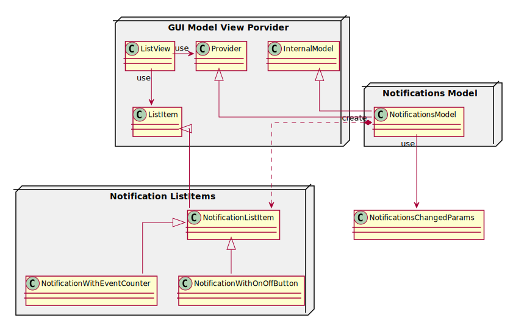

# Home Screen Notifications

## General structure
The general structure is based on the `Model-View` pattern on the front-end, supplied with a `Provider`'s back-end notifications as follows:

## Provider structure

On the provider's end, `Notifications` are managed by `NotificationProvider` and sent as an `NotificationsChanged` action with `NotificationsChangedParams` via `ApplicationManger`'s `Controller`.

The `NotificationProvider` is responsible for creating and managing `Notifications`. Each `Notification` represents a unique 
event and thus at most single object (of a respective type) can be stored in the provider. The provider's structure is shown on following diagram:

## Model-View structure

`NotificationsModel` is responsible for creating and decorating `NotificationListItem`s based on `NotificationsChangedParams` received. 
The model serves also as a local provider for `gui::ListView`.

