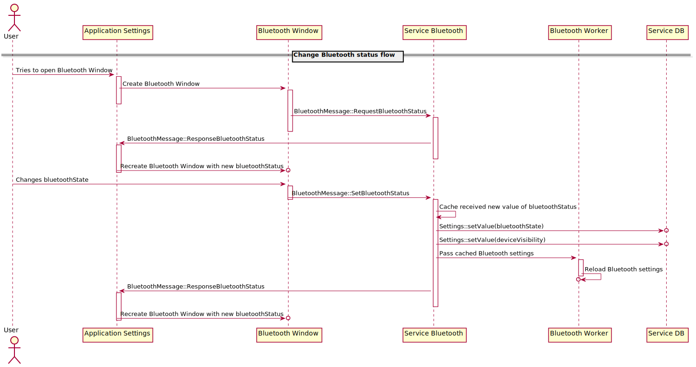
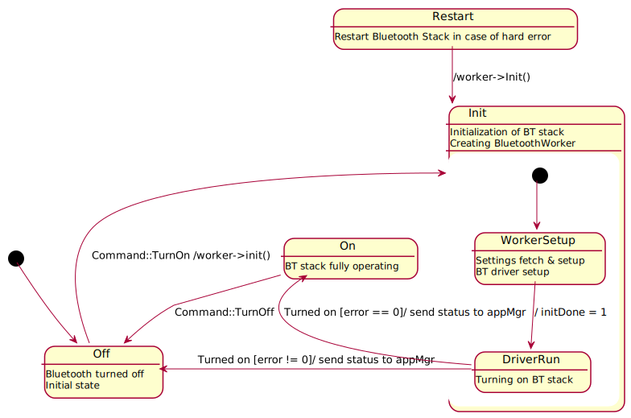

# Bluetooth interface layer

Right now it properly uses API from bsp/bsp-bluetooth and BlueKitchen stack.  
It's meant to provide interface layer for service-bluetooth like that:
>>> os calls <=> service-bluetooth <=> module-bluetooth <=> bluetooth library
>>>                                                     <=> bsp/bluetooth

## Layout
* `Bluetooth`
    * `interface` code - for other modules to use
        * `profiles` - implementation of Bluetooth profiles
    * `glucode` code needed for libraries to work
* `lib`
    Libraries used with as little modifications as possible

## Events flowchart

# Proposal of Bluetooth settings data flow

The Bluetooth settings related data flow is directed by three main entities:
1. `ServiceDB` that is responsible for storing data in DB
2. `ServiceBluetooth` that is responsible for general Bluetooth management, and communication between ServiceDB and ApplicationSettings
3. `ApplicationSettings` that is responsible for `PurePhone<->User` interactions in this context

`ServiceBluetooth` communicates with `ServiceDB` via `SettingsAgent`, and uses `BluetoothMessages` for communication with `ApplicationSettings`.
It contains `BluetoothSettings` object for caching settings received from `ServiceDB` and `ApplicationSettings`.
`ServiceBluetooth` uses `BluetoothWorker` to control bluetooth stack.

When `ServiceBluetooth` is being created, it registers on a value change in *DB* for each variable related to *BluetoothSettings* and binds callback functions for them.
When *DB* responds with new values of *BluetoothSettiings* - related variables, callback function of each variable stores its value in cache object (*BluetoothSettings*) in `ServiceBluetooth`, then unregisters from changes in *DB*.
When all variables are loaded from *DB*, then *BluetoothWorker* reloads Bluetooth stack with data from *BluetoothSettings* object.

Flowchart below is an example of scenario, when user opens *BluetoothWindow*, and tries to change some of settings presented there.

# Bluetooth on/off state machine diagram
To be able to handle all events during start up and shutting down of the Bluetooth module the following state machine has been implemented:

