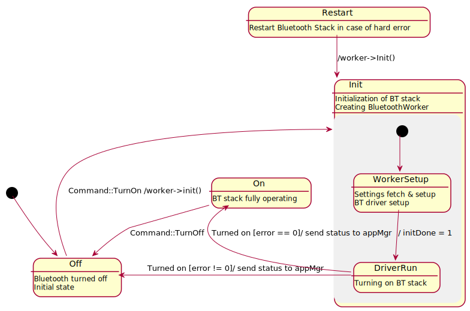

# Bluetooth on-off operation
This document aims to describe the basics of the Bluetooth module power management.

## Turning on the Bluetooth module
The Bluetooth module (hereinafter referred to as BT module) is connected to the processor via UART. 
Additionally, a reset pin is available to put the BT module into a reset state, which is used in the "power on" procedure.
UART data transfers have been made using DMA, which speeds up the data rate. To be able to properly init the BT module, 
the following steps have to be taken:

- Enable and configure UART interface
- Enable and configure DMA channels
- Properly init the BT module

Enabling and configuring UART and related DMA channels is done in the BSP (board support package) module, 
therefore there is no need to describe it here. Those BSP functions are encapsulated and used by the Bluetooth stack library.

### Power on procedure
- send `message::bluetooth::SetStatus` message with `BluetoothStatus::State::On` value
- wait for settings change: `bluetooth::Settings::State` set to `BluetoothStatus::State::On`

#### A low-level flow of what's inside
After the `BluetoothWorker` receives `bluetooth::Command::PowerOn` (sent by `ServiceBluetooth` after receiving the state change message),
the state machine executes driver's `init` method. After the init is done, the Bluetooth stack is prepared to be run by the `run` method of the `Driver` class - 
it's done as the next step of the init procedure. When the Bluetooth stack has been initiated, the settings holder updates the BT state in the settings.

## Turning off the Bluetooth module
Turning off the BT module is basically reversed turning on - after sending the proper message, the Bluetooth driver 
turns off the Bluetooth stack. When the Bluetooth stack is turned off, the UART with DMA channels is deinitialized and BT module is put
to the reset state.

### Power off procedure
- send `message::bluetooth::SetStatus` message with `BluetoothStatus::State::Off` value
- wait for settings change: `bluetooth::Settings::State` set to `BluetoothStatus::State::Off`

## Bluetooth on/off state machine diagram
To be able to handle all events during start up and shutting down of the Bluetooth module the following state machine has been implemented:

