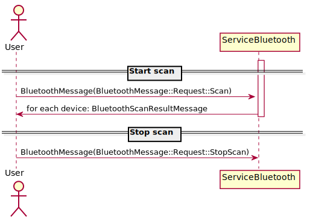

# Bluetooth scan
To be able to send data between devices it is necessary to pair the devices, and to know the physical address
of the BT device, there is a need to perform devices scan.

## Principle of operation
Bluetooth scan works underneath the `ServiceBluetooth` - it is done on the middle layer, in the GAP profile interface.
When scan request is executed, GAP performs the scan and sends scanned devices to the `ApplicationSettings`. In case when the BT
module has discovered a device without a name, it will try to fetch the device name in another request. After the name-fetching
is complete, the `ServiceBluetooth` sends back the device to the application.

### Scan flow (user point of view)
- send `BluetoothMessage(BluetoothMessage::Request::Scan)` to the `ServiceBluetooth`
- for each scanned device receive `BluetoothScanResultMessage` 
- process the device
- send `BluetoothMessage(BluetoothMessage::Request::StopScan)` to the `ServiceBluetooth` to stop the scan.

