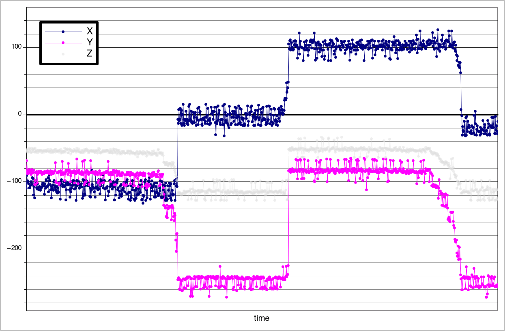

# ALS31300 Hall effect sensor
This magnetometer is used as a detector of the slider position, which has a magnet attached to itself. When slider position changes,
the magnetic field intensity measured by the sensor is changing and is properly interpreted to determine the position of the slider.

## Values per position

<b>Positions: down, middle, up, middle</b>

As shown on the graph, using only X and Y axes can clearly determine the slider position so this has been implemented.

## Magnetometer configuration
Looking at the graph it's easy to find out, that each slider position has some mean value of the magnetic field intensity. This particular
sensor has the possibility to generate an interrupt on its pin when the absolute threshold has been exceeded or the increment of
the intensity related to the last taken measurement was higher than a certain, set value.

In this case, increment (delta) mode has been used, combined with Low Power Delta Compare Mode (LPDCM) - 
magnetometer cycles between active and inactive state and takes measurements. When the change in the magnetic field has been higher than
set value, it generates an interrupt for the main processor, which then retrieves the measurements and does proper action.

## Caveats

- once the magnetometer has been put to the LPDCM mode it cannot be read nor written until the interrupt happens - despite the datasheet which claims,
that the device should respond to the I2C commands, the only answer to every one command was NAK,
- setting a too small period for LPDCM mode (too small inactivity time) caused some instability during tests, 
- to get proper measurements after receiving the interrupt, there's a need to put the magnetometer to the active state,
  then take measurements and put it again to the LPDCM mode - doing anything else means the measurements data was inaccurate and way off.

