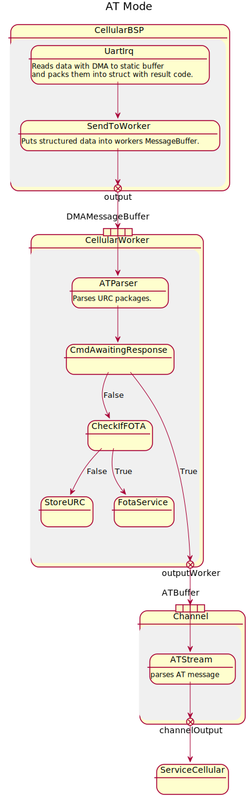

# Cellular Multiplexer

## Table of contents
1. [History](#history)
2. [Modes](#modes)
3. [Single command data flow](#singlecmd)
5. [Cellular result structures](#result)
6. [Error codes](#errors)

## Modes <a name="modes"></a>
Cellular operates in three modes:
 - AT,
 - CMUX setup,
 - CMUX

The AT mode is used for communication setup and modem configuration.



The CMUX setup is an intermidiate state starting a CMUX communication:
 - It configures CMUX mode's transmission parameters.
 - It creates channels for a frame multiplexing (Commands, Notifications, Data).
Data flow for both CMUX and CMUX setup in current implementation is identical.


For more details, see [channel implementation](./doc/ATStream.md).

## Single command data flow <a name="singlecmd"></a>


A single command sequence starts with a call from the Service and can end in one of three ways:
 - Command response timeout (timeout depends on command issued).
 - Service receives an error in result and handles it accordingly. 
 - Command response is successfully parsed before timeout and passed to service layer.

## Result structs <a name="result"></a>

Currently, there are two types of structs used to pass data between contexts.

DMA result struct is used to directly store data from DMA engine as well as pass these through 
MessageBuffer to Worker. This struct has static data buffer maximum size.


Cellular Result is used to pass complete frames serialized in vector together with 
result code. This struct has variable size.


## Error codes <a name="errors"></a>


Currently there are different errors/results codes for different layers.

  1. CellularResultCode
     This code is used to pass information from bsp layer up to channel.
     It can be either used to handle flow control messages from DMA or 
     to pass failures to upper layer (transmission/receiving not starter, 
     cmux frame error).

     ```
     Uninitialized,
     ReceivedAndIdle,
     ReceivedAndFull,
     ReceivedAfterFull,
     ReceivedNoData,
     ReceivingNotStarted,
     TransmittingNotStarted,
     CMUXFrameError, 
     ```

  2. AtResult
     This result code is passed to service layer. 

        ```
        OK,              /// at OK
        ERROR,           /// at ERROR For compatibility also for CME_ERROR and CMS_ERROR (details in errorCode)
        CME_ERROR,       /// In case CME error see errorCode
        CMS_ERROR,       /// In case CMS error see errorCode
        TIMEOUT,         /// at Timeout
        TOKENS,          /// at numbers of tokens needed met
        NONE,            /// no code
        UNDEFINED,       /// undefined result - usage of Undefined result, define and pin result to use it
        PARSING_ERROR,   /// parser error
        FULL_MSG_BUFFER, /// at not enough space left in message buffer for new message
        TRANSMISSION_NOT_STARTED, /// at dma not starting transmission
        RECEIVING_NOT_STARTED,    /// at dma not starting requested receiving
        DATA_NOT_USED,            /// at received data not being used
        CMUX_FRAME_ERROR,         /// at cmux deserialize error
        ```
