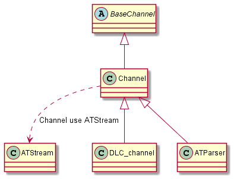
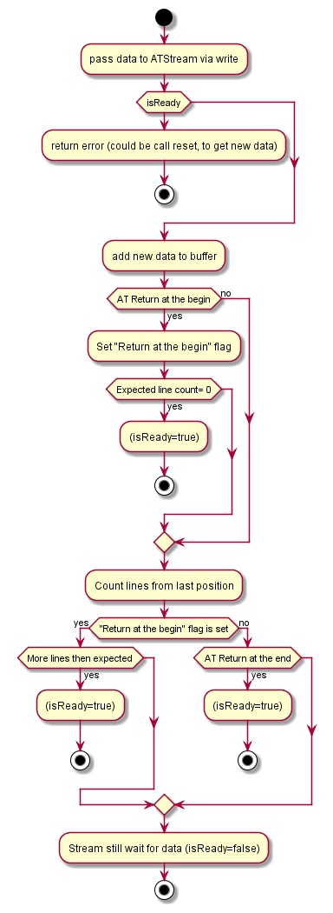

# Channel implementation

## Table of contents
1. [History](#history)
2. [Scope](#scope)
3. [Current implementation](#current-implementation)

## History

| Authors           | Change description        | Status | Modification date |
| ----------------- | ------------------------- | ------ | ----------------- |
| Bartosz Reichel | Initial version           | Draft  | 2021.02.10        |

## Scope
Description of dependencies for channel and ATStream usage 

## Current implementation

When initializing the modem, communication is direct via the UART channel through the ATParser channel (AT commands). 
At CMUX configuration, the channel for AT commands is represented by DLC_Channel (see Channel::Commands and also 
Channel::Notifications and Channel::Data).

Both ATParser and DLC_Channel use ATStream (in Channel) for parsing AT command. ATStream parse AT commands in terms of correctness /return (not the selected command) 

below way of how ATStream parse command (especially such strange like QPING)

