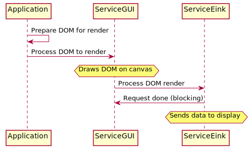
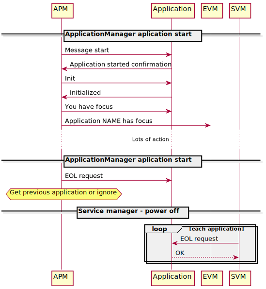
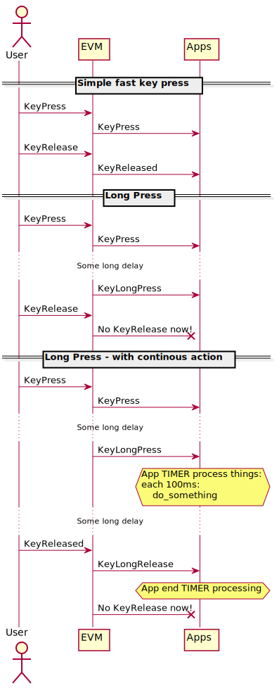
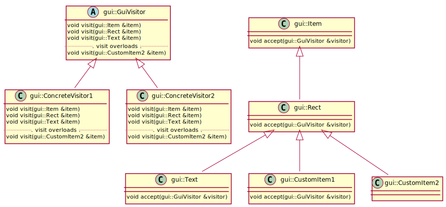
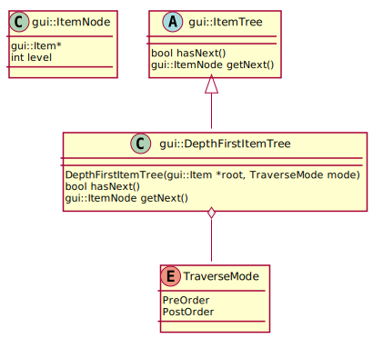
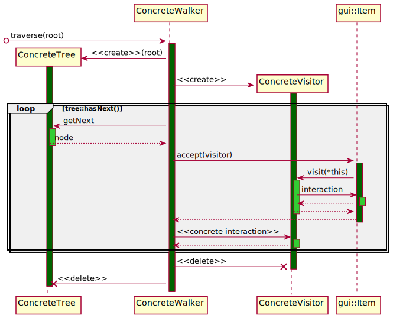

# Graphic User Interface

This article includes details on how MuditaOS widgets are rendered and how the GUI handles key pressing.

## Introduction

### How widgets are rendered



* All widgets are children of `gui::Item`
* There are two major commands to trigger screen redraw:
    * `gui::Item::buildDrawList` in each `gui::Item` - uses `gui::Item`s tree to builds draw commands 
    * `app::Application::refreshWindow` in `app::Application` - triggers update on display on message: `gui::AppRefreshMessage` (final draw on screen done with: `app::Application::render`)
* All interface actions can be made with either:
    * `gui::Item` callbacks, which are in [callbacks](@ref callbacks "Item callbacks"), or
    * `gui::Item` virtual functions, [callback functions](@ref callbackCallers) When overriding please mind that you might want to use ancestor function inside too to i.e. not loose key presses etc.
* All `gui::Item` are able to handle keyPresses via `gui::InputEvent`
* All `gui::Item` are able to traverse down on their `gui::Item::children` and know which child has `gui::Item::focusItem` at the time

### How does it work on the application side

Please see `app::Application`, `app::manager::ApplicationManager` for detailed information on how messages are handled between both. This is just general documentation.



These actions are done on a chained bus request between: `app::Application`, `app::manager::ApplicationManager` and `sapm::EventWorker`

All of these are asynchronous and there is little state machine maintenance.

1. `app::Application` has it's own state which is managed both in application and in manager (via setters and getters)
2. `sapm::ApplicationManager` has it's own state which tells what exactly it's processing right now

**Note:** All `app::Application`:

1. Register and initialize their windows on start of the application in `app::Application::createUserInterface`
2. Need to pass `app::Application::DataReceivedHandler` first to parent function call to properly handle bus messages
3. Have windows based on `gui::AppWindow`

**Note:** When it comes to `gui::AppWindow`:

1. `gui::AppWindow::buildInterface` has to call parent build interface first. Otherwise elements for child won't be created and it will crash
2. `gui::AppWindow::onInput` has to call parent `onInput`, otherwise handling key presses will fail
3. Applications react on key **releases** actions, in most scenarios key press event is useless
4. all applications, if it hasn't been overriden in `gui::AppWindow` will try to return to previous window or application on `back`

## `gui::Item` Key Press handling

### What happens when you press a key?



* `bsp` handles key press on I2C IRQ and sends Event to event worker on naked FreeRTOS pipe (on target RT1051, on Linux `gtk` does that)
* `EventWorker` worker of `EventService`:
    * handles the press and sends it to current Application
    * with focus (**Note:** when no application is in focus this will not work)
* application can either:
    * process `gui::InputEvent` with `RawKey` or `gui::KeyInputSimpleTranslation`
    * use callbacks (see how to handle key press below)
    * use widgets which override default key handling (see `gui::Item::onInput`)
    * have own `gui::KeyInputMappedTranslation` +  `gui::InputMode` and process key press however they want

### How to handle key press

There are at least 3 ways to handle key press, listed in order of execution:
* `gui::Item::onInput` - if not redefined calls `inputCallback`; if handled here, other calls wont be called
* `gui::Item::inputCallback` - handles any key
* `gui::Item::activatedCallback` - handles Enter key only
* `gui::Item::itemNavigation` - handles up,down,left,right if next/previous elements are added for an item

**Note:** return `True` when any of callbacks ends processing the whole Items tree

There are 2 set of parameters for key press:
* `gui::InputEvent::State` - state of key (pressed, released, long released). In general **applications handle key releases** not presses
* `gui::KeyCode`   - initially parsed key code
* `gui::RawKey`  - raw key code, to be processed in widget based on event i.e. translate pressing key `1` 3 times into C in `gui::Text` mode `ABC`

### How to add key mapping when basic key maps are not enough?

* Key maps are specific key translation mappings i.e. press `1` 3 times to get C, press `1` 4 times to get A, etc.
* basic key maps are stored in: `InputMode`, right now there are following `InputMode::Mode`s: [`ABC`, `abc`, `digit`, `phone`]
* key maps in `gui::InputMode` are changed in regards of language settings

#### How to add a new key map

How to add a new key map, i.e. `phone`:

1. Add new file for your key map: `cp image/assets/profiles/template.kprof image/assets/profiles/phone.kprof`
2. Change your template accordingly
3. Pin new key map (add it to language support) by adding: `"common_kbd_phone": "phone"` to at least `image/assets/lang/lang_en.json` if it will differ per language, prepare one `kprof` file per language
4. Add new key map to `gui::InputMode`
    - Add `InputMode::Mode` enum i.e. `InputMode::Mode::phone`
    - Add new mode to input mode mapping in `InputMode.cpp` (same as with other enums)
    - Test newly added mode in: `UITestWindow.cpp`
    - Test new key map on phone
5. Load key map to phone

Now you can use `InputMode::Mode::phone` translation in `gui::Text` widget.
This means `gui::Text` will automatically change text on key press for you, same as in modes `InputMode::Mode::phone` etc.

## Adding new functionalities - visitor pattern in `gui::Item`

The `gui::Item` class is compatible with visitor pattern providing double dispatch behaviour.
The double dispatch mechanism for all classes in `gui::Item`'s inheritance hierarchy enables easily equipping them with new polymorphic behavior without changing classes themselves.

### Structure

Every new functionality to be added to `gui::Item` hierarchy requires creation of new concrete visitor that publicly inherits from `gui::GuiVisitor` interface and specifies respective behavior.
In order to ensure that a class in `gui::Item` hierarchy is recognized by its concrete type in `ConcreteVisitor::visit(...)` method, class must override `gui::Item::accept(gui::GuiVisitor &)`,
otherwise it will be resolved as a closest ancestor. On the diagram below both `gui::CustomItem1` and `gui::CustomItem2` will be resolved as `gui::Rect`
despite existing `gui::GuiVisitor::visit(gui::CustomItem2 &)` overload and `gui::CustomItem1::accept(...)` override.



### Tree of `gui::Item`

Each `gui::Item` object is used as a node to build a UI general tree.
That relation can simply be thought of as a tree of dependencies with a node being a parent of zero, one or more other nodes.
Concerning the need of a `ConcreteVisitors` to visit not only the parent but also all its children,
`gui::ItemTree` is an interface class providing abstract interface for implementation of `gui::Item` tree traversal.
The concrete realization of `gui::ItemTree` is `gui::DepthFirstItemTree`.



#### Depth-First tree of `gui::Item`

`gui::DepthFirstItemTree` builds tree of parent-children relation for any `gui::Item` pointed as the root.

The class offers two traverse modes:
* `PreOrder` - in this mode a parent precedes all its children
* `PostOrder` - in this mode all children precede their parent

### Example



## Domain Object Model of `gui::Item`

Each `gui::Item` object can be serialized into JSON-formatted stream using `gui::Item2JsonSerializer`.
The serializing class employs dedicated `gui::Item2JsonSerializingVisitor`, `gui::DepthFirstItemTree` in `PostOrder` mode 
in a sequence flow analogous to the one presented above. Please find an exemplary fragment of DOM serialization output below.

```asm
{"Rect": {
    "Active": true, 
    "BorderColor": [0, 0], 
    "Children": [
        {"Label": {
            "Active": true, 
            "BorderColor": [0, 0], 
            "ChildrenCount": 0, 
            "Corners": 240, 
            "DrawArea": [20, 445, 440, 30], 
            "Edges": 0, 
            "FillColor": [15, 15], 
            "Filled": false, 
            "FlatEdges": 0, 
            "Focus": false, 
            "ItemType": 0, 
            "PenFocusWidth": 2, 
            "PenWidth": 1, 
            "TextValue": "Interval Chime", 
            "Visible": true, 
            "WidgetArea": [0, 0, 440, 30], 
            "WidgetMaximumArea": [0, 0, 440, 30], 
            "WidgetMinimumArea": [0, 0, 440, 30], 
            "YapSize": 10, "Yaps": 0}
        },
        {"Label": {...}}
    ], 
    "ChildrenCount": 2, 
    "Corners": 240, 
    "DrawArea": [20, 445, 440, 60], 
    "Edges": 0, 
    "FillColor": [15, 15], 
    "Filled": false, 
    "FlatEdges": 0, 
    "Focus": true, 
    "ItemType": 0, 
    "PenFocusWidth": 2, 
    "PenWidth": 1, 
    "Visible": true, 
    "WidgetArea": [20, 445, 440, 60], 
    "WidgetMaximumArea": [0, 0, 440, 60], 
    "WidgetMinimumArea": [0, 0, 440, 60], 
    "YapSize": 10, "Yaps": 0}
}
```

## Widgets

- [Window](WINDOW.md)
- [Text](gui/widgets/text/doc/HowDoesTextWork.md)
