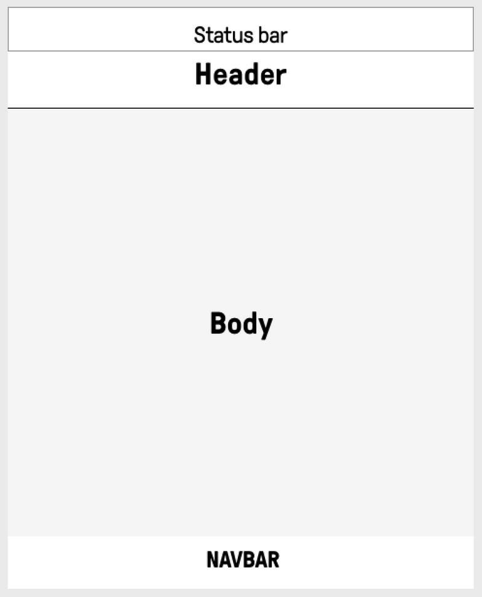

# GUI Window

This article describes window used in Pure project. Window is base applications view used 
to display information back to users.

## Structure

Window consist of 4 different segments presented on image below. 

* `StatusBar` - Top part of screen displaying system wide information. In example Time, Signal Strength, 
selected sim. Objects in status bar are not focusable and activeable. 
* `Header` - Displaying selected window information. Mainly its title and in addition window particular input actions
descriptions. In example adding object to list, search and emergency calls action. Objects in header are not focusable 
and activeable.
* `Body` - Main part of window responsible for displaying and manipulating window logic. In example: contact information, 
 sms list manipulations, alarm clock settings. Objects in Body are focusable and activeable. 
* `NavBar` - Bottom part of window displaying input action descriptions assigned to main keyboard keys (Left Function key, 
Enter Key, Right Function Key). In example: accepting prompt, going to previous window, selecting object. Objects in 
NavBar are not focusable and activeable.