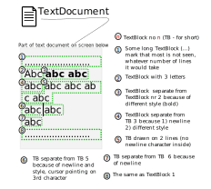

# Introduction

## Glosary

* Text formatting: bold, underline, strikethrough, font - all visual parameters of text to be shown on screen

## Classes explanation

We needed to somehow handle text + it's properties which might take more than one screen at a time.

To do so we've decomposed gui::Text item to possibly single responsibility objects:

*Non visual*:
* gui::text::Document item providing us with text, representing on what we normaly understand as "document" (some, possibly mulit page long formatted text). Formated text stored in Document as Blocks
* gui::text::Block formated part of text representation, stores text and it's format, may end with newline or with end of formatting (i.e. with end of bold)
* gui::text::Cursor element pointing to some place in document, used to navigate it and edit ( like iterator/`FILE*` etc) our way to access whats in document

*Visual*
* gui::TextLine visual line representation in gui::Text <- build on request from document via gui::TextCursor - just a render
* gui::TextCursor visual cursor representation in gui::Text <- extends cursor, used to access data which gui::Text have in gui::text::Document
* gui::Text base textual widget controlling text display and modification, consists of: TextLines, TextCursor and text text::Document

## Visual relationship between classes "on screen"



## TextCursor movement - how it works?

### Generally 

* Remove removes character previous to cursor, if no character previous to cursor - remove one before, if no chars - do nothing.
* Append adds character after current cursor position, then increments cursor position by 1 (and moves it visualy 1 right) 
* Delete removes character before current cursor position, decrements it by 1 (and moves it visualy by 1 left)
* Movement moves left/right ,no up/down support yet, if cursor is at the end/begin of block it uses up one key press to move between blocks

*Warning*
* TextCursor implements movement of rect which "walks" on Text drawn on screen
* Cursor implements where and what is removed/added

```
When changing how removing / adding are seen on screen and react to key presses TextCursor should be updated, not Cursor
```

#### key handling cases


#### text movement, addition and remove in action


## special character input

Characters which are not available via key presses are available under special character selection on long press on down left key.
One of these keys is newline.

### special char selection - how it works example


## digit input in textual mode

User can input digits while in textual mode with long press of selected digit key on keyboard. i.e. long press 1 will put in 1

### Digit long press - how it works example


