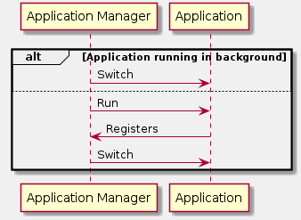
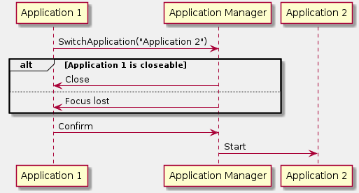
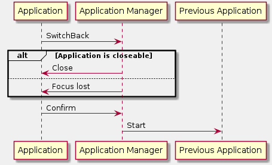
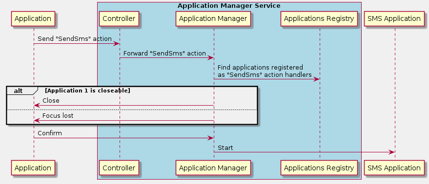

# Application Manager

The Application Manager service is responsible for application lifecycle and switching between applications and views.
This includes:
- starting
- closing
- registering
- switching applications and views
- managing display access

## Initialisation

## Starting application

##  Switching between applications

## Switching to previous application

## New Application Manager - Proposal

Main problems of current implementation:
1. Application knows the name of another application it wants to switch to.
2. Each application is responsible for implementing the logic of an action (e.g. sending an SMS) on its own. In that context, the Application Manager is responsible only for switching between apps.

The proposal of New Application Manager solves these problems.

Applications do not request for application switch explicitly. Instead, applications send action requests to the Application Manager.
The action request may contain:
- Type of action, e.g. `SendSMS`
- Generic data storage

Depending on the action's type, the Application Manager decides which application should handle it, based on the application's manifest.
Thanks to that, Application Manager decouples applications.

### Registering applications

Before start, each application will register its manifest to the Application Manager.
The manifest will be stored in the Applications Registry.

The manifest may contain the following information:
- Application name
- Whether the application should run in background/foreground
- Actions it is able to handle

Once the action is requested, the Application Manager retrieves action handlers from the Application Registry.

### Generic data

It should be possible to send any custom data along with the action request.
This is the reason, why action request will implement storage for generic data.

The idea is to create a base for such generic data. It should be able to serialize and deserialize into/from a data storage, e.g. JSON, FlatBuffers, binary formats.

When sent, the data will be serialized into the data storage, and only that storage shall be sent along with the action request.

When received, the data will be re-created from the storage and used by a receiver object.
