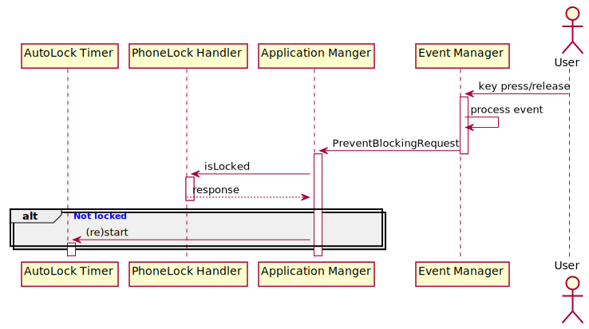
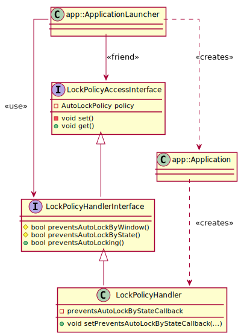

# Automatic locking 

## General structure 

## User activity detection 

The main feature of auto-locking mechanism is locking the phone if user is being inactive for some period 
of time. This is realized with help of the `Event Manager` Service (`EM`), that is responsible, among others, 
for managing a user's input (key press-release). On an input, that provides an evidence of the user's activity,
the `EM` sends the `PreventBlockingRequest` unicast message to the `Application Manger` Service (`APM`).
The message is used as a trigger to restart the auto-lock timer, as shown on the following sequence diagram: 

## Application's auto-lock policies 

In some situations the phone cannot be locked automatically and thus the auto-locking mechanism provides the ability to detect
such cases. It is determined by a state of the currently focused application. There are three auto-lock policies that 
manage the state an application, that should be stated in the Application's manifest:
* `DetermineByWindow` - the default value causing an application to be locked automatically if currently displayed window does not prevent it.
* `DetermineByAppState` - a policy that checks if both window and current application state allows for autolock.
* `PreventPermanently` - a permanent state in which an application cannot be locked automatically. Once set it cannot be unset.

Each Application has the `LockPolicyHandler` class that manages and enforces policies. In case of `DetermineByAppState` policy, 
an application should provide its own implementation of  the `preventsAutoLockByStateCallback` to the `LockPolicyHandler`. 
The policy, determined in the manifest, is set by `app::ApplicationLauncher` using `LockPolicyHandlerInterface`.

## Locked-Phone interactions

When the phone is already locked, there is no need for the timer to be running. For this reason the auto-lock timer's start and stop calls 
are related to the `PhoneLockHandler`. In case when the `PhoneLockHanlder` indicate that the phone is locked, the timer will not be restarted
whether by itself or by the `PreventBlockingRequest` message. On the other hand the timer is started once again when the `PhoneLockHanlder`
sends the multicast message `UnlockedPhone`.
