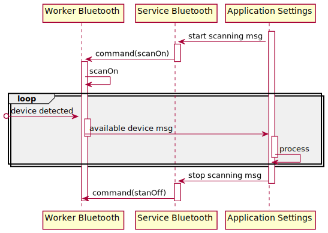

# Bluetooth Service
The Bluetooth Service is responsible for communicating the Bluetooth subsystem with rest of the operating system. 

## Connecting to the Bluetooth device
To be able to connect to the device with more than one [audio profile](https://en.wikipedia.org/wiki/List_of_Bluetooth_profiles), the Profile Manager has been developed.
It allows connecting to the A2DP and HSP profiles at once while maintaining the flexibility of switching between them without any additional lag, which could happen during reconnecting to the device.
It provides the following functionalities:
- connecting/disconnecting to the device
- switching between A2DP (high-quality audio) and HSP (headset profile) back and forth
- stream control: pause, resume, start, stop

A temporary user interface is located in place of the old Bluetooth settings.

The Bluetooth message API will be unified shortly to allow integrating it with the audio service.

## Scanning - general view 

The Bluetooth scanning procedure is triggered by and terminated with specific, asynchronous messages. Upon receiving 
a `StartScan` message the `ServiceBluetooth` shall send `ScanOn` command to the `WorkerBluetooth`, responsible for the `Pure-BT`-device
management. Until the `ScanOff` command is not received, the worker will continue to notify `ApplicationSettings` with detected devices.
The above is summarized on the following sequence diagram:

## Pairing - general view

The Bluetooth pairing procedure starts with the following preconditions
* the scanning has been performed and the `ApplicationSettings` has received a list of available devices successfully,
* `ApplicationSettings` has registered its on-bonded-devices-changed-callback in `DatabaseAgent`.

On that premise, `ServiceBlueooth` will receive a `Pairing` message with an address (of a device the initiator requests pairing with)
and forward it in the form of the `Pair` command to `WorkerBluetooth`. After successful pairing, the worker will serialize 
and send the device data to `DatabaseAgent` so the event result could be saved and its recipient notified. Unpairing flow is 
analogous to the pairing procedure with no requirement of an external Bluetooth device involvement.

