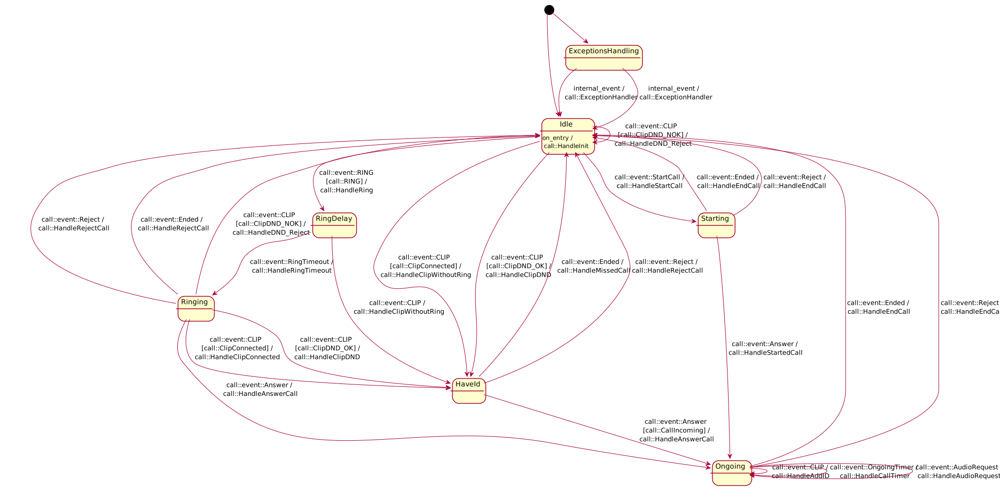

Call documentation
==================

MuditaOS call library that is able to perform:
- ingoring and outgoing calls
- perform call filtering
    - on RING (notification that there is incomming call)
    - on CLIP (notification on identified call)
    - based on contacts
    - based on phone mode

The call logic is one of oldest functionalities in the OS, which was being changed mulitiple times in the past.
Therefore it has multiple visible (mis)conceptions. Curent aproach we want to keep is:
- Call handling logic should be in CellularCall.hpp it's an interface for ServiceCellular to use to perform calls
    - Especially all actions changing call - i.e. hanging, acting upon CLIP/RING, or setting up audio
    - It's responsible to multicast specyfic call states to parties interested (i.e. call answered)
- Call UI should be in application-call - and only UI, there should be no more state handling then required to show UI
    - all actions that changes call - shoud be passed to CellularCall

**NOTE:** Historically lots of state keeping was done in application call, while quite a bit of logic was glued in ServiceCellular - this is wrong way to go.


# library organisation

This library's goal is to encapsulate the whole call flow/flows we can have.
It's end goal is to provide: actions and guards to write call state machine to asure full control over call processing.

Public api headers should be placed in `include/call/` catalog - these are exported in cmake to include paths for related libraries
All other headers should **not** be placed there. These are private internals of the library

# Call - how to write logic

CellularCall.hpp is written such as:
- CellularCall is state machine processor
- It has Call StateMachine inside and drives it
- API it requires is in `api` catalog
    - any api has to first define virtual interface
    - then define platform implementation

State machine is written using [boost::stm](https://boost-ext.github.io/sml/index.html)

**NOTE** API catalog should and can be further split into api header and platform implementation.

# Call state machine

Call state machine can be generated with:
```
ninja call_uml
call_uml > call.puml
```

Latest generated UML:


**NOTE*:** The UML is generated automatically, for better readability please change lambdas to functions
