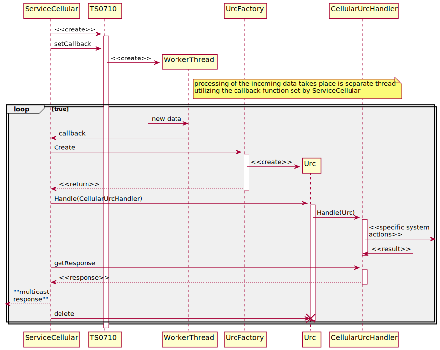
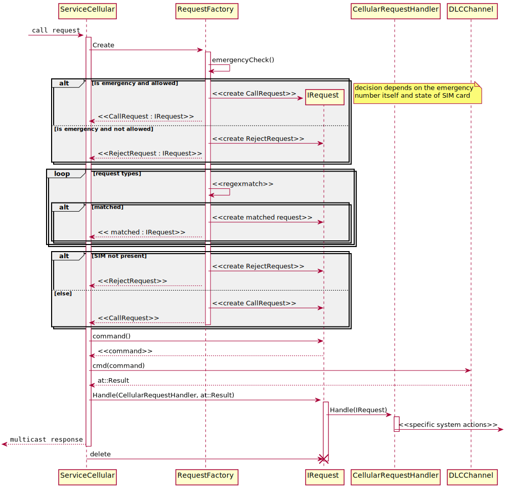

## Service Cellular state machine

Full state machine of Cellular service could be found below.

## GSM powerup/powerdown control flow

In order to protect system of sudden blackout, GSM module has to be switched off below certain critical battery level.
This way system voltage will not be dropped down when module is trying to acheive cellular network connection.

## URC handling flow

## Call Request handling flow

Call request represents the string written by te user in the input window.
It can be request of external phone number but also emergency call request,USSD code request or MMI request.
The logic has to recognize the request and apply proper action.

