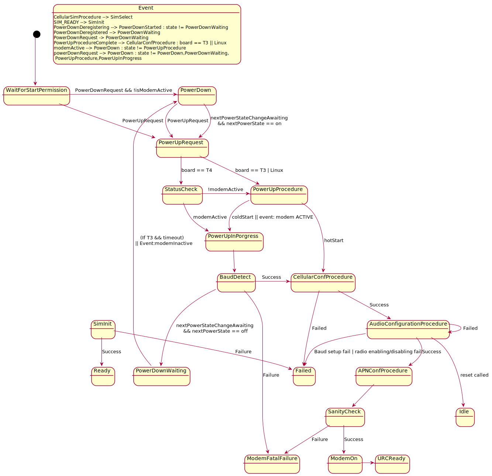

## Service Cellular state machine

Full state machine of Cellular service could be found below.

## GSM powerup/powerdown control flow

In order to protect system of sudden blackout, GSM module has to be switched off below certain critical battery level.
This way system voltage will not be dropped down when module is trying to acheive cellular network connection.

