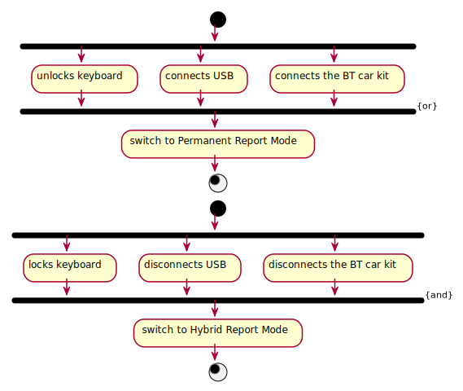
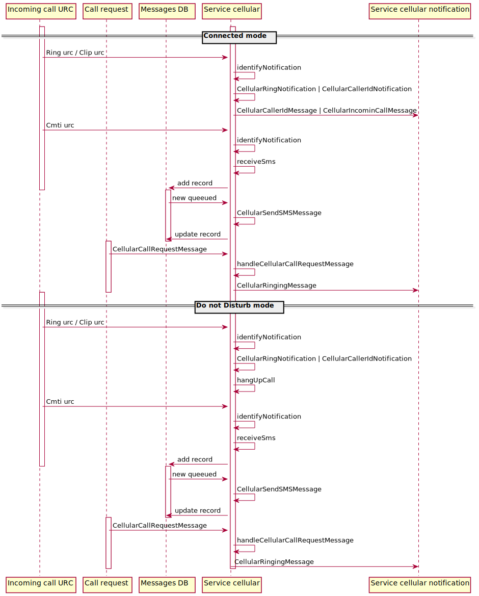
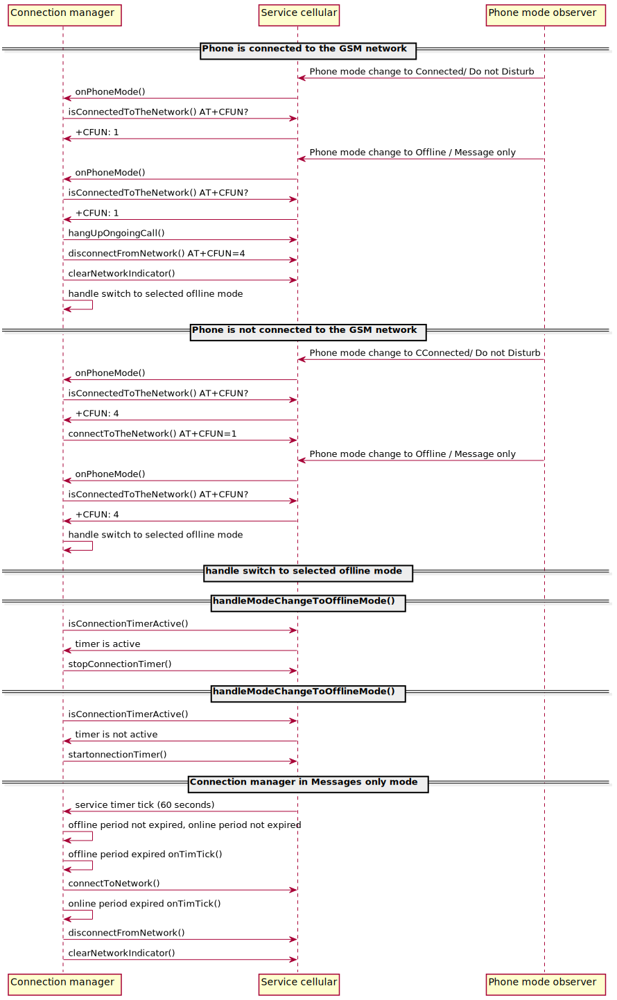

## Service Cellular state machine

Full state machine of Cellular service could be found below.

## GSM powerup/powerdown control flow

In order to protect system of sudden blackout, GSM module has to be switched off below certain critical battery level.
This way system voltage will not be dropped down when module is trying to acheive cellular network connection.

## URC handling flow

## CSQ handling flow

There are 3 modes of CSQ signal handling:
* Permanent Reporting

The host is constantly waiting to report data from the modem when the CSQ signal changes. This mode is active only when the user unlocks the keyboard or connects USB or connects the BT car kit.

* Hybrid Reporting

The host waits for data to be reported from the modem when the CSQ signal changes until the data is received more frequently than parameter 'cellular::service::urcThreshold'. When the threshold is exceeded, the mode changes to Hybrid Pooling.

* Hybrid Polling

Data reporting is disabled. The host queries the modem for the current CSQ value every 15 minutes. Every time specified by the 'cellular::service::pollTime' parameter, the system enters Hybrid Reporting mode again.

## Call Request handling flow

Call request represents the string written by te user in the input window.
It can be request of external phone number but also emergency call request,USSD code request or MMI request.
The logic has to recognize the request and apply proper action.

## Cellular sleep mode

Conditions for cellular to enter sleep mode: 
* no ongoing call
* communication with the modem is complete
* 1 seconds of inactivity on RX / TX UART lines

Conditions for cellular to exit sleep mode: 
* incoming URC
* any activity in communication via UART to the modem

Host Enables GSM Module to Enter into Power Saving Mode:
* Pull DTR and WAKEUP pins from LOW to HIGH, and trigger the module to enter into power saving mode
* Set AP_READY pin as invalid
* Disable UART clock
* CPU sentinel release block frequency request

Host Enables GSM Module to Exit from Power Saving Mode:
* Enable UART clock
* Host pulls DTR and WAKEUP pins from HIGH to LOW, and triggers module to exit from power saving mode
* Set AP_READY pin as valid

GSM Module Enables Host to Exit from Power Saving Mode
* Host receives the change of RI pin, then exits from power saving mode and enters into normal mode
* CPU sentinel block frequency decreasing below 24 MHz
* The wake-up described in the point above takes place

## Phone modes in cellular

Conditions for cellular to switch the phone mode
* Phone mode changes on event provided by 'phoneModeObserver'

Connected mode
* no actions are needed to meet the Connected mode criteria, calls and messages are allowed

Do not Disturb
* incoming calls are rejected 
* outgoing calls, incoming and outgoing messages are allowed

Offline mode
* modem is disconnected from the GSM network, both calls and messages are rejected

Messages only mode
* modem is disconnected from the GSM network, calls are rejected, sending messages is rejected
* phone is connecting to the GSM network in selected by settings period to fetch incoming messages

| | Connected | Do not Disturb | Offline | Message only |
| ----------- | --------- | -------------- | ------- | ------- |
|Incoming calls| Allowed | Rejected | Not allowed | Rejected |
|Outgoing calls| Allowed | Allowed | Not allowed | Rejected |
|Incoming messages| Allowed | Allowed | Not allowed | Rejected |
|Outgoing messages| Allowed | Allowed | Not allowed | Partially allowed |

