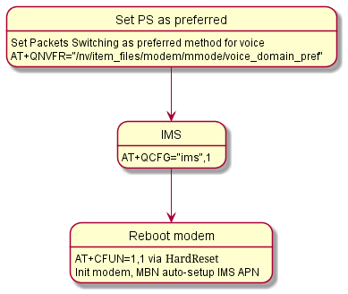
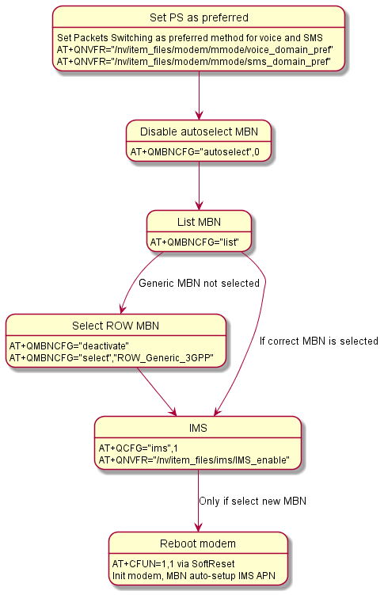

# VoLTE

## Table of contents
1. [History](#history)
2. [Scope](#scope)
3. [Introduction](#introduction)
4. [Current implementation](#current-implementation)
5. [Implementation manual select](#implementation-with-manual-select)
6. [Debug command](#debug-command)


## History

| Authors           | Change description        | Status | Modification date |
| ----------------- | ------------------------- | ------ | ----------------- |
| Bartosz Reichel | Initial version           | Draft  | 2021.01.29        |


## Scope
This document defines how VoLTE is run on modem


### Introduction

Considerations on implementing / running VoLTE in the context of various operators will be included here. 
The mechanisms available in Quectel modems will be described.


## Current implementation

### VoLTE On flow

The current implementation only puts voice call in PS (Packet Switch) mode. Automatic selection of MBN files is used depending on the searched operator (assuming that ROW_Generic_3GPP will be selected for one not on the list). In the current implementation, the modem restart is performed every time. 



## Implementation with manual select

### VoLTE on flow

This implementation, disable autoselect of MBN and propose to choose ROW_Generic_3GPP.
This proposal came from one of the cellular network engineers, there is a certain probability that in the absence of the MBN file for the selected network, the wrong one may be selected. 

In this case, the restart is only performed when the MBN is changed (currently it is not possible to implement this functionality due to the large response message via UART). 



## Debug command

Command *AT+QVOLTEDBG* is not full documented but propably return all parameters needed by Quectel modem to setup for VoLTE.
Here example of return (@ could be treat as AT+)

```
@+QNVFR="/nv/item_files/modem/mmode/voice_domain_pref"
+QNVFR: 03
@+QNVFR="/nv/item_files/modem/mmode/sms_domain_pref"
+QNVFR: 01
@+QNVFR="/nv/item_files/ims/IMS_enable"
+QNVFR: 00
@+QCFG="ims"
+QCFG: "ims",0,0
@+CGDCONT?
+CGDCONT: 1,"IP","internet","0.0.0.0",0,0,0,0
+CGDCONT: 2,"IP","","0.0.0.0",0,0,0,0
+CGDCONT: 3,"IPV4V6","","0.0.0.0.0.0.0.0.0.0.0.0.0.0.0.0",0,0,0,1
+CGDCONT: 5,"IP","internet","0.0.0.0",0,0,0,0
@$QCPDPIMSCFGE?
$QCPDPIMSCFGE: 1 , 0 , 0 , 0
$QCPDPIMSCFGE: 2 , 1 , 0 , 0
$QCPDPIMSCFGE: 3 , 1 , 0 , 0
$QCPDPIMSCFGE: 5 , 0 , 0 , 0

@+CIMI
260060031******
@+QCCID
+QCCID: 89480610500613*****
@+CSQ
+CSQ: 10,99
@+QNWINFO
+QNWINFO: "HSPA+","26006","WCDMA 900",2938
@+CGACT?
+CGACT: 1,1
+CGACT: 2,0
+CGACT: 3,0
+CGACT: 5,0
@+CGPADDR
+CGPADDR: 1,"100.***.***.***"
+CGPADDR: 2,"0.0.0.0"
+CGPADDR: 3,"0.0.0.0,0.0.0.0.0.0.0.0.0.0.0.0.0.0.0.0"
+CGPADDR: 5,"0.0.0.0"
@+CVERSION
VERSION: EG25GGBR07A08M2G
Jun 13 2020 16:25:23
Authors: QCT
@+QMBNCFG="autosel"
+QMBNCFG: "AutoSel",0
@+QMBNCFG="list"
+QMBNCFG: "List",0,1,1,"ROW_Generic_3GPP",0x05010820,201905141
+QMBNCFG: "List",1,0,0,"VoLTE-ATT",0x0501033C,202004261
+QMBNCFG: "List",2,0,0,"hVoLTE-Verizon",0x05010141,202004091
+QMBNCFG: "List",3,0,0,"Sprint-VoLTE",0x05010205,201908141
+QMBNCFG: "List",4,0,0,"Commercial-TMO_VoLTE",0x05010505,201811231
+QMBNCFG: "List",5,0,0,"Telus-Commercial_VoLTE",0x05800C43,201912031
+QMBNCFG: "List",6,0,0,"Commercial-SBM",0x05011C18,202004211
+QMBNCFG: "List",7,0,0,"Commercial-DT",0x05011F1C,201905311
+QMBNCFG: "List",8,0,0,"Reliance_OpnMkt",0x05011B38,202003251
+QMBNCFG: "List",9,0,0,"TF_Germany_VoLTE",0x05010C1B,202004151
+QMBNCFG: "List",10,0,0,"TF_Spain_VoLTE",0x05010CFA,201909261
+QMBNCFG: "List",11,0,0,"Volte_OpenMkt-Commercial-CMCC",0x05012071,202004161
+QMBNCFG: "List",12,0,0,"OpenMkt-Commercial-CT",0x05011322,202001171
+QMBNCFG: "List",13,0,0,"OpenMkt-Commercial-CU",0x05011505,202001171
+QMBNCFG: "List",14,0,0,"Telstra-Commercial_VoLTE",0x0580079E,202006101
+QMBNCFG: "List",15,0,0,"Commercial-KDDI",0x0501071D,202004041
+QMBNCFG: "List",16,0,0,"Commercial-DCM",0x05010D17,202006101
+QMBNCFG: "List",17,0,0,"Commercial-SKT_VoLTE",0x05012724,201907221
+QMBNCFG: "List",18,0,0,"Commercial-KT",0x05012C0D,202005071

OK

```
