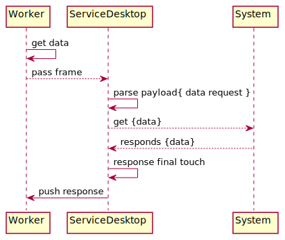

Service Desktop
=================

This service is handling communication between Mudita Desktop App and PurePhone.


### Protocol description

#### Message structure

**[ message_type | payload_length | payload[0] | payload[1] | ... | payload[payload_length-1]**

```
uint8_t message_type;
uint8_t payload_length[9];
uint8_t payload[payload_length];
```

##### Message types
*Single printable ASCII character.*
```
endpoint = '#'
rawData = '$
```
##### Payload length
*Represented by 9 printable ASCII characters.*

##### Payload structure
*Simple json with some fields. Difference between request and response payload is "method" and "status" fields.*
```
requestPayloadJson:
{
     { "endpoint", endpointNumber },
     { "method", methodNumber},
     { "body", requestBodyJson },
     { "uuid", uuidNumber }
}
```
```
responsePayloadJson:
{
     { "endpoint", endpointNumber },
     { "status", statusCode},
     { "body", responseBodyJson },
     { "uuid", uuidNumber }
}
```
###### Endpoint
*Each endpoint has its unique number.*

```
invalid             = 0
deviceInfo          = 1
update              = 2
filesystemUpload    = 3
backup              = 4
restore             = 5
factory             = 6
contacts            = 7
messages            = 8
calllog             = 9
calendarEvents      = 10
developerMode       = 11
bluetooth           = 12
usbSecurity         = 13
```

###### Method
*HTTP - like methods. Each has different number. Only in request message.*

```
get     = 1
post    = 2
put     = 3
del     = 4
```

###### Status
*HTTP status codes. Only in response message.*

```
OK                  = 200
Accepted            = 202
NoContent           = 204
SeeOther            = 303
BadRequest          = 400
Forbidden           = 403
NotFound            = 404
NotAcceptable       = 406
InternalServerError = 500
NotImplemented      = 501
```

###### Body
*Actual response from endpoint in response message. In request message its optional and depends on used method.*

##### Example request

```
#000000053{"endpoint":1, "method":1, "payload":{"test":"test"}}
```

##### Example response

```
#000000095{"endpoint": 1, "status": 200, "body": {"charging": true, "level": 75, "maximumCapacity": 100}}
```

#### Sample requests
*Contacts*
get contact:
```
#000000056{"endpoint":6, "method":1, "uuid":1, "body":{"count":5}}
```
response:
```
#000000859{"body": [{"address": "6 Czeczota St.\n02600 Warsaw", "altName": "Bolig<0xc5><0x82>owa", "blocked": false, "favourite": true, "id": 19, "numbers": ["500639802"], "priName": "Alek"}, {"address": "6 Czeczota St.\n02600 Warsaw", "altName": "Bolig<0xc5><0x82>owa", "blocked": false, "favourite": true, "id": 22, "numbers": ["500453837"], "priName": "Gra<0xc5><0xbc>yna"}, {"address": "6 Czeczota St.\n02600 Warsaw", "altName": "Bolig<0xc5><0x82>owa", "blocked": false, "favourite": true, "id": 20, "numbers": ["500545546"], "priName": "Zofia"}, {"address": "6 Czeczota St.\n02600 Warsaw", "altName": "Bubel", "blocked": false, "favourite": true, "id": 44, "numbers": ["500087699"], "priName": "Brian"}, {"address": "6 Czeczota St.\n02600 Warsaw", "altName": "Bubel", "blocked": false, "favourite": true, "id": 43, "numbers": ["500656981"], "priName": "Cezary"}], "endpoint": 6, "status": 200, "uuid": 3}
```

update contact:
```
#000000203{"endpoint":6, "method":2, "uuid":123, "body":{"address": "6 Czeczota St.\n02600 Warsaw", "altName": "Cic", "blocked": true, "favourite": true, "id": "43", "numbers": ["724842187"], "priName": "Baatek"}}
```
response:
```
#000000043{"endpoint": 6, "status": 500, "uuid": 123}/
```
```
#000000043{"endpoint": 6, "status": 204, "uuid": 123}
```

add contact:
```
#000000191{"endpoint":6, "method":3, "uuid":123, "body":{"address": "6 Czeczota St.\n02600 Warsaw", "altName": "Cic", "blocked": true, "favourite": true, "numbers": ["724842187"], "priName": "Baatek"}}
```
response:
```
#000000043{"endpoint": 6, "status": 204, "uuid": 123}
```

remove contact:
```
#000000057{"endpoint":6, "method":4, "uuid":123, "body":{"id": 23}}
```
response:
```
#000000043{"endpoint": 6, "status": 204, "uuid": 123}
```

### Service documentation

#### High level view




#### System asynchronous calls synchronization

Calls from the outside world are REST-like. This means that:
- each call contains single request 
- for each call event there is a single response

To provide a synchronous response for a asynchronous system call we have special mechanism.

1. Send: `DeveloperModeRequest` message with special `Event` Data
2. Process `DeveloperModeRequest` in system, fill in `Event` Data
3. Pass `DeveloperModeRequest` back to requester
