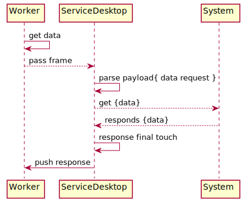

Service Desktop
=================

This service is handling communication between Mudita Desktop App and PurePhone.

**Note:
Service desktop is disabled by default.
To turn it on, please uncomment this line in main.cpp:**

`        ret |= sys::SystemManager::CreateService(std::make_shared<ServiceDesktop>(), sysmgr.get());
`

### Protocol description

#### Message structure

**[ message_type | payload_length | payload[0] | payload[1] | ... | payload[payload_length-1]**

```
uint8_t message_type;
uint8_t payload_length[9];
uint8_t payload[payload_length];
```

##### Message types
*Single printable ASCII character.*
```
enum class Type
    {
        endpoint = '#',
        rawData = '$'
    };
```
##### Payload length
*Represented by 9 printable ASCII characters.*

##### Payload structure
*Simple json with some fields. Difference between request and response payload is "method" and "status" fields.*
```
requestPayloadJson:
{
     { "endpoint", endpointNumber },
     { "method", methodNumber},
     { "body", requestBodyJson },
     { "uuid", uuidString }
}
```
```
responsePayloadJson:
{
     { "endpoint", endpointNumber },
     { "status", statusCode},
     { "body", responseBodyJson },
     { "uuid", uuidString }
}
```
###### Endpoint
*Each endpoint has its unique number.*

```
enum class Endpoint
{
    deviceInfo = 1,
    update
};
```

###### Method
*HTTP - like methods. Each has different number. Only in request message.*

```
enum class Method
{
    get = 1,
    post,
    put,
    del
};
```

###### Status
*HTTP status codes. Only in response message.*

```
enum class Code
{
    OK = 200,
    BadRequest = 400,
    InternalServerError = 500
};
```

###### Body
*Actual response from endpoint in response message. In request message its optional and depends on used method.*

##### Example request

```
#000000053{"endpoint":1, "method":1, "payload":{"test":"test"}}
```

##### Example response

```
#000000095{"endpoint": 1, "status": 200, "body": {"charging": true, "level": 75, "maximumCapacity": 100}}
```

#### Sample requests
*Contacts*
get contact:
```
#000000056{"endpoint":6, "method":1, "uuid":1, "body":{"count":5}}
```
response:
```
#000000861{"body": [{"address": "6 Czeczota St.\n02600 Warsaw", "altName": "Bolig<0xc5><0x82>owa", "blocked": false, "favourite": true, "id": 19, "numbers": ["500639802"], "priName": "Alek"}, {"address": "6 Czeczota St.\n02600 Warsaw", "altName": "Bolig<0xc5><0x82>owa", "blocked": false, "favourite": true, "id": 22, "numbers": ["500453837"], "priName": "Gra<0xc5><0xbc>yna"}, {"address": "6 Czeczota St.\n02600 Warsaw", "altName": "Bolig<0xc5><0x82>owa", "blocked": false, "favourite": true, "id": 20, "numbers": ["500545546"], "priName": "Zofia"}, {"address": "6 Czeczota St.\n02600 Warsaw", "altName": "Bubel", "blocked": false, "favourite": true, "id": 44, "numbers": ["500087699"], "priName": "Brian"}, {"address": "6 Czeczota St.\n02600 Warsaw", "altName": "Bubel", "blocked": false, "favourite": true, "id": 43, "numbers": ["500656981"], "priName": "Cezary"}], "endpoint": 6, "status": 200, "uuid": "3"}
```

update contact:
```
#000000203{"endpoint":6, "method":2, "uuid":123, "body":{"address": "6 Czeczota St.\n02600 Warsaw", "altName": "Cic", "blocked": true, "favourite": true, "id": "43", "numbers": ["724842187"], "priName": "Baatek"}}
```
response:
```
#000000057{"body": "", "endpoint": 6, "status": 500, "uuid": "123"}/
```
```
#000000057{"body": "", "endpoint": 6, "status": 200, "uuid": "123"}
```

add contact:
```
#000000191{"endpoint":6, "method":3, "uuid":123, "body":{"address": "6 Czeczota St.\n02600 Warsaw", "altName": "Cic", "blocked": true, "favourite": true, "numbers": ["724842187"], "priName": "Baatek"}}
```
response:
```
#000000057{"body": "", "endpoint": 6, "status": 200, "uuid": "123"}
```

remove contact:
```
#000000057{"endpoint":6, "method":4, "uuid":123, "body":{"id": 23}}
```
response:
```
#000000057{"body": "", "endpoint": 6, "status": 200, "uuid": "123"}
```

### Service documentation

#### High level view



#### System asynchronous calls synchronization

Calls from the outside world are REST-like. This means that:
- each call contains single request 
- for each call event there is a single response

To provide a synchronous response for a asynchronous system call we have special mechanism.

1. Send: `DeveloperModeRequest` message with special `Event` Data
2. Process `DeveloperModeRequest` in system, fill in `Event` Data
3. Pass `DeveloperModeRequest` back to requester
