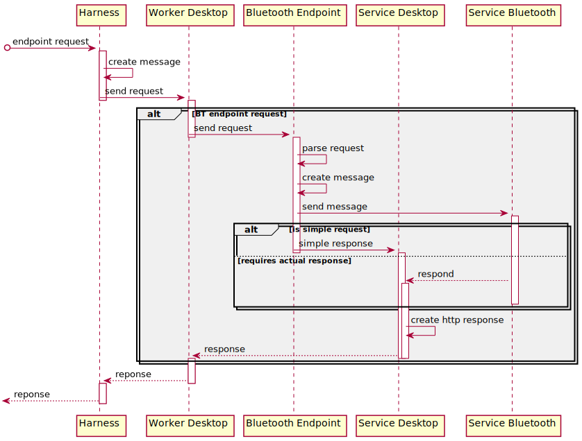

# Bluetooth Service endpoints

The following document provides a description of the `ServiceBluetooth` endpoints. 

## Overview



## Calling HTTP methods
The `Bluetooth` endpoint supports four HTTP-like methods: 
 * `POST - "post"`
 * `GET - "get"`
 * `PUT - "put"`
 * `DELETE - "del"`

### POST

Argument    | Value                         | Expected response| Description
--------    | -----                         | -----------------| -----------
`"pair"`    | `address`                     | `SimpleResponse` | Requesting pairing with the device with given address.
`"connect"` | `address`                     | `SimpleResponse` | Requesting connecting with the device with given address.

### GET

Argument    | Value                         | Expected response         | Description
--------    | -----                         | -----------------         | -----------
`"state"`   | `True`                        | `ResponseStatus`          | Requests current state of the `Pure-BT`.
`"devices"` | `"scanned"`                   | `ResponseVisibleDevices`  | Requests list of currently available `BT`s.
`"devices"` | `"bonded"`                    | `ResponseBondedDevices`   | Requests list of `BT`-devices that the `Pure-BT` is currently paired with and address of the `BT`-device that `Pure-BT` is connected to. 
### PUT

Argument    | Value                         | Expected response| Description 
--------    | -----                         | -----------------| -----------
`"command"` | `"scanOn"`                    | `SimpleResponse` | Turing the `Pure-BT`-scan functionality on. 
.           | `"scanOff"`                   | `SimpleResponse` | Turing the `Pure-BT`-scan functionality off.
.           | `"changeVisibility"`          | `SimpleResponse` | Changing the `Pure-BT`'s visibility.
`"state"`   | `{"power: "on/off"}`          | `SimpleResponse` | Turning the `Pure-BT` on/off.
.           | `{"visibility": "on/off"}`    | `SimpleResponse` | Turning the `Pure-BT`'s visibility on/off.

### DELETE

Argument    | Value                         | Expected response| Description
--------    | -----                         | -----------------| -----------
`"unpair"`  | `address`                     | `SimpleResponse` | Requesting unpairing with the `BT`-device with given address.
`"command"` | `"disconnect"`                | `SimpleResponse` | Requesting disconnecting with the `BT`-device `Pure-BT` is currently connected to.

## Responses
Each response has to be serialized for consistency with the following structure
```
responsePayloadJson:
{
    { "endpoint", endpointNumber },
    { "status", statusCode},
    { "body", responseBodyJson },
    { "uuid", uuidString }
}
```
The `Bluetooth` endpoint provides responses according to the following table: 

Response                | Body 
--------                | ----
`SimpleResponse`        | `{}`
`ResponseStatus`        | `{"state", {"power": "on/off", "visibility" : "on/off" }}`
`ResponseVisibleDevices`| `{"devices", [{"name": name1, "address" : address1 }, ..., {"name": nameN, "address" : addressN }]}`
`ResponseBondedDevices` | `{"address" : addressOfConnectedToDevice, "devices", [{"name": name1, "address" : address1 }, ..., {"name": nameN, "address" : addressN }]}`
