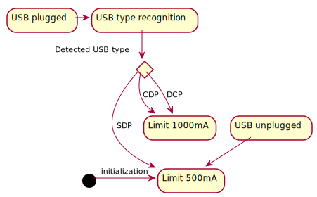
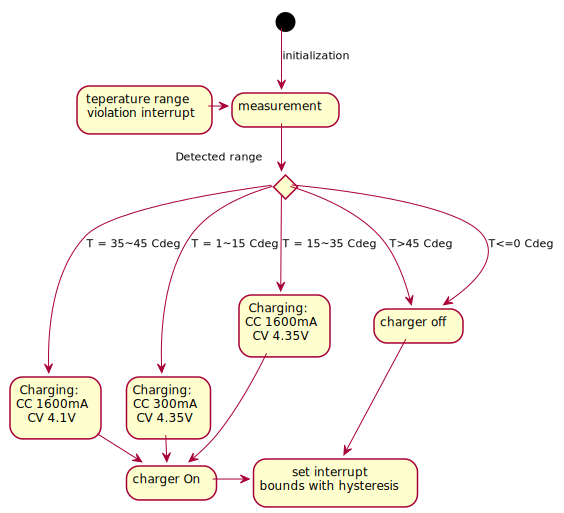

# Battery Charger operation

Pure Phone utilize MAX77818 driver for battery charging and power conversion between phone, battery and USB power input. This chip is also capable of SOC (State Of Charge) measurement which outputs battery level in percentage. This part of charger is known as Fuel Gauge (FG). FG is equipped in mathematical model of the battery to correctly estimate SOC based on voltage and current measurement, mainly utilizing integral of the current flowing in/out. This model has numeorus parameters which are tuned automatically across the lifetime of the battery. Those parameters are held in the driver's registers in volatile memory and has to be dumped to non-volatile memory in the system in order to preserve them.

Due to learning process of the FG algorithm and integral-based measurement of SOC, the sufficient amount of time is needed for FG to track SOC correctly. Due to those reasons, phone is intended to work with a single battery in order to have right SOC information. Changing battery requires at least one cycle of charging and discharging to obtain real SOC estimate.

## Charger state information

Charger informs about its state change through interrupts. System can recognize several events signalized by the charger:
- SOC 1% change
- Charger plug in/out
- End of charging process
- Cell temperature range violation
- Brownout voltage level threshold violation

## Fuel gauge parameters

Initial fuel gauge parameters has to be provided on battery charger initialization. First run will give rough estimate based on battery voltage level. Then the learning process starts. Pure OS is holding parameters of the FG in a file in the `/sys/user` directory of the filesystem. Parameters are stored in file in case of two events:
- Battery charging process finish.
- Phone shutdown (clean shutdown).

In case of phone crash, recent parameters as well as last SOC readout will be not preserved. Due to volatile memory of the charger, SOC information also has to be preserved. Value saved to file will be used as initial at the next boot.

## Charging current selection algorithm

Battery charger has no capabilities to recognize USB thus this operation has to be done on the side of main processor.
Default current limit of a charger to draw from USB port is 500mA. Due to several USB source types additional algorithm was introduced to rise this limit and provide faster battery charging. Depending on current output capabilities, several USB types could be distinguished:
- Standard downstream port (SDP)
- Charging downstream port (CDP)
- Dedicated charging port (DCP)

PureOS limits the bus current to 500mA, in case of SDP, and to 1000mA in case of CDP and DCP. USB type recognition is part of the USB stack.

## Charger cutoff due to temperature

In order to prevent fast battery cell degradation, charging action needs to be controlled in specific temperature ranges. Given requirements from battery specification:
- 1 to 15 Cdeg : 0.2C current limit
- 15 to 35 Cdeg : 1C current limit
- 35 to 45 Cdeg : 4.1V charging voltage

For battery in the system value of 1C equals 1600mA. 

**NOTE: Charging current limit has lower priority than USB current limit. Therefore, final charging current will be lower than USB current.**

Implementation is interrupt-driven. In interrupt handler temperature measurement is sampled and appropriate interrupt range is set. The same action is done at the time of initialization. This way no cyclic sampling of the temperature has to be done. Algorithm could be described by following graph:

Additional 2 Cdeg hysteresis was introduced to prevent rapid changes in charging states.

## Battery Brownout Detection

Battery charger chip is capable of providing interrupt when low voltage threshold is violated. This voltage value is instantaneous measurement. To prevent spurious brownout events, additional algorithm was introduced. This kind of false detection could occur when phone call is stared and GSM module consumes high current what results in narrow voltage dip. Interrupt from battery charger creates a time window of 5 seconds and every second filtered value of voltage is sampled. If any of those samples drop below given 3.6V threshold, the brownout event is fired.
