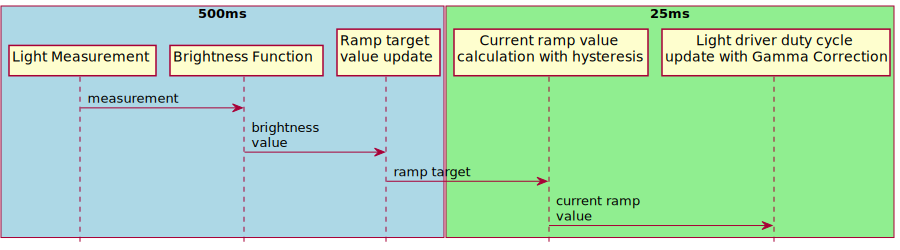
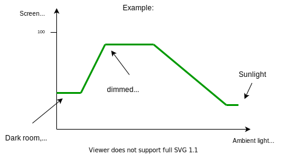
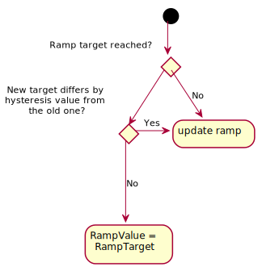
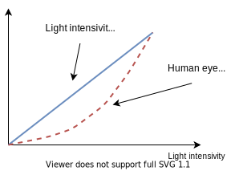

# Screen frontlight control

## Modes of operation

Screen frontlight can be controlled in Manual and Standalone mode.

### Manual mode

Manual mode refers to constant level of the screen brightness passed to
screen_light_control module via messages. 

### Automatic mode

In the automatic mode screen light is controlled using data from the ambient light sensor. This data is 
then processed with brightness function mapping to obtain particular level of screen lighting. Control algoritm contains ramp, hysteresis and gamma correction calculation.



## Brightness level function
Brightness level [%] in relation to ambient light luminance level [Lux] is passed as 
a vector of points wchich are automatically interpolated with linear function. These
points have to be in ascending order. Example:

```
sevm::screen_light_control::BrightnessFunction({{50.0f, 30.0f}, {150.0f, 80.0f}, {400.0f, 80.0f}, {700.0f, 40.0f}});
```
Which could be transleted as follows:



NOTE: Values before first point and after last point are set to constant level of brightness described by this points. Values in between are interpolated.

## Ramp
Values of screen brightness are udpated in faster control loop with ramping to acheive smooth change of light. Ramp value could be parametrized and refers to 0-100% change of brightness in given number of miliseconds.

## Hysteresis

Hysteresis value is adjustable via API.



## Gamma correction
Gamma correction is algorith to adjust change of the light intesisivity in the way that it is perveied as linear by human eye.

y(x) = scale*(x/scale) <sup>&gamma;</sup>

Where &gamma; is parametrizable correction factor

