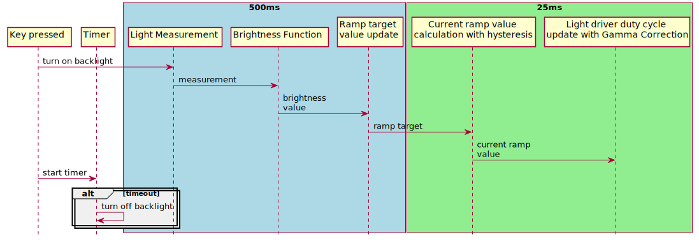
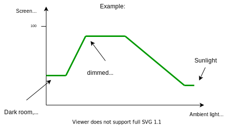
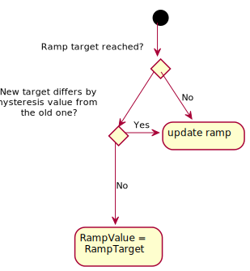
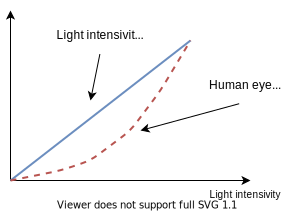
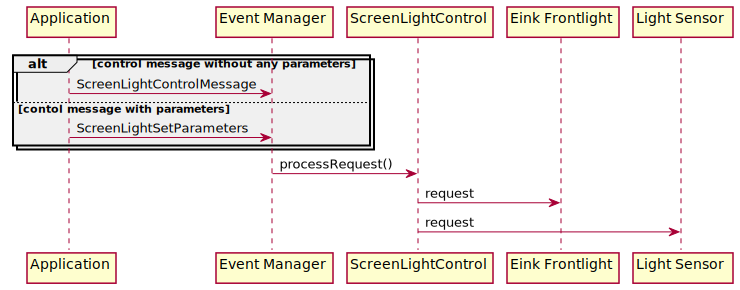

# Screen frontlight control

## Modes of operation

Screen frontlight can be controlled in Manual and Standalone mode.

### Manual mode

Manual mode refers to constant level of the screen brightness passed to
screen_light_control module via messages in field `sevm::screen_light_control::Parameters::manualModeBrightness` .

### Automatic mode

In the automatic mode screen light is on for a 5s from last key press and is controlled using data from the ambient light sensor. This data is 
then processed with brightness function mapping to obtain particular level of screen lighting. Control algoritm contains ramp, hysteresis and gamma correction calculation.



## Brightness level function
Brightness level [%] in relation to ambient light luminance level [Lux] is passed as 
a vector of points wchich are automatically interpolated with linear function. `sevm::screen_light_control::Parameters::functionPoints` field is used for parametrization. These
points have to be in ascending order of luminance values. Example:

```
sevm::screen_light_control::BrightnessFunction({{50.0f, 30.0f}, {150.0f, 80.0f}, {400.0f, 80.0f}, {700.0f, 40.0f}});
```
Which could be translated as follows:



NOTE: Values before first point and after last point are set to constant level of brightness described by this points. Values in between are interpolated.

## Ramp
Values of screen brightness are udpated in faster control loop with ramping to acheive smooth change of light. Ramp value could be parametrized in `sevm::screen_light_control::Parameters::rampTimeMS` and refers to 0-100% change of brightness in given number of miliseconds.

## Hysteresis

Hysteresis value is adjustable via API using `sevm::screen_light_control::Parameters::brightnessHysteresis`.



## Gamma correction
Gamma correction is an algorithm to adjust change of the light intesivity in the way that it is perceived as linear by human eye.



Gamma correction is described by formula:

y(x) = scale*(x/scale) <sup>&gamma;</sup>

Where &gamma; is parametrizable correction factor in `sevm::screen_light_control::Parameters::gammaFactor`. Scale is used to normalize x value to 0-1 range.
Default value of &gamma; is 2.5 . For leds this factor could be in range 2.2-2.8.


## Message API

`screen_light_control::ScreenLightControlMessage` is used to control the module. It takes action as a parameter. Set of actions is described in `sevm::screen_light_control::Action`.
`screen_light_control::ScreenLightSetParameters` is used to control the module. It takes action and data structure as parameters. Set of actions is described in `sevm::screen_light_control::ParameterizedAction`.
`screen_light_control::ScreenLightControlRequestParameters` is used to request currently setup parameters for display light and sensor.


