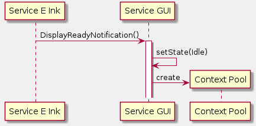
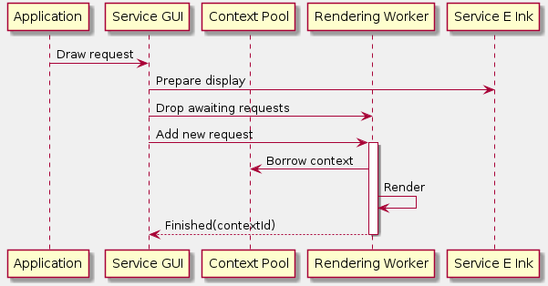
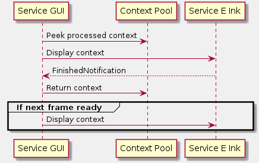
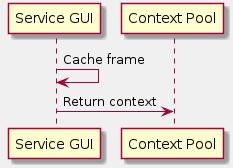

# GUI service

The GUI service is responsible for rendering frames and sharing them with the E Ink service. This includes:
- Managing the pool of contexts
- Dropping frames that are not needed anymore
- Rendering frames
- Controlling the flow of sharing frames with the E Ink service

## Pool of contexts

The context is a drawing area. It is used by a renderer to render a frame, which is then forwarded by the GUI service to the E Ink service.

The pool of contexts provides exclusive access to a context in a multithreaded environment. The renderer service locks the context during rendering process. The context is unlocked and available for the renderer service again once it's not used by any other object, e.g. it was displayed by the E Ink service, or cached by the GUI service for later use.

## Initialization

The GUI service is initialized on the E Ink service demand. It uses information received from the E Ink service in order to initialize its resources, e.g. ContextPool.

## Handling draw requests

Draw request is an application's request used to render the screen.

### Dropping expired draw requests

If a consecutive request comes to the GUI service, all awaiting requests which deal with the same display area are marked as expired and dropped.
This solution makes the display more responsive. Removing it from the current implementation may introduce a latency visible to a user when e.g. writing a message.

## Sharing the frame with the E Ink service

### Idle state

If the GUI service is not busy waiting for the previous frame to be displayed by the E Ink service, it immediately sends the rendered frame to the E Ink service.

### Busy state

The GUI service may render a few next frames while the E Ink service is updating the display. If so, the GUI service caches the last rendered frame and immediately sends it to the E Ink service once it finishes its job.

