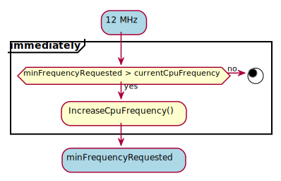

# Power Management

Power management is based on the frequency control of the CPU. 

## CPU frequency switching

The CPU frequency control is dependent on the CPU load measured from the time spent in the task Idle. This control is also influenced by requests from interested services via sentinels (`minFrequencyRequested`). By increasing the CPU frequency, we always jump to the maximum possible frequency value, unless it is requested by the setinel then we increase the frequency to the minimum required. On the other hand, the reduction of the CPU frequency occurs gradually one level down.

**Examples:**

1. Increasing CPU frequency
     - On high CPU load
     
     - On request
     
     
2. Decreasing CPU frequency

   

## Low Power synchronization

Synchronization in Low Power mode covers 3 issues:

* immediate informing services about changing the CPU frequency so that they can update their resources (e.g. PWM filling)

* immediate switching on of peripherals that have been turned off by Low Power control (e.g. PLL2)

* request from the service of the minimum CPU frequency in order to perform a task (e.g. screen redraw, telephone conversation)

### Implementation 

To cover these issues, several classes have been implemented.

* Sentinel class

Each sentinel manages the requests, i.e. when it is needed it sends messages to `CpuGovernor` with the required minimum CPU frequency to perform the task (e.g. screen redraw). Furthermore, every sentinel is informed immediately after changing the frequency. This allows it to invoke a callback to the service to update its resources (e.g. PWM filling). Every sentinel must register itself on startup to `CpuGovernor` by sending `SentinelRegistrationMessage`.

* CpuGovernor class

`CpuGovernor` manages all sentinels in the system and has CPU frequency requests from them (e.g. `eInkSentinel`).

* Driver class

Dedicated drivers control the clocks. For example, `driverLPSPI` enables/disables the clock from LPSPI.

* PLL2 class

DriverPLL2 controls the PLL2 bus clock and if all dependent clocks are turned off, it turns off the PLL2 bus clock.

* Device class

Each driver (eg LPSPI) inherits from the Device class. Therefore, we can manage all drivers. Every device must register itself on startup to `DeviceManager` by sending `DeviceRegistrationMessage`.

* DeviceManager class

`DeviceManager` manages all devices on the system. It can turn off all devices and thus dedicated clocks.

### CPU frequency update

`PowerManager` periodically checks the CPU load and queries `CpuGovernor` to determine the conditions for changing the CPU frequency.
After changing CPU frequency, all sentinels must be synchronously updated (e.g. `eInkSentinel`, `cellularSentinel`) so that they can update their resources (e.g. PWM fill)

### Resource request

Below is an example of requesting resources from `service_eInk` to redraw the screen:

and requesting resources from `service_cellular` to make a phone call:

# CpuStatistics

CpuStatistics measurement is described in: [link](./module-sys/SystemManager/doc/CpuStatistics.md)
