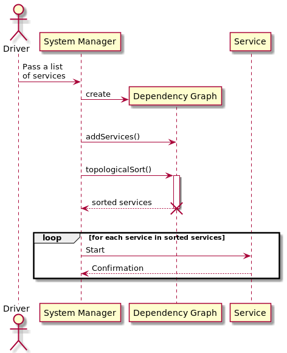

# Services synchronization

If a service has dependencies to other services, it should be started after its dependencies are started.

For example, a ServiceA may be dependent on the ServiceDB. It means that the ServiceA can not be started unless the ServiceDB successfully starts.

It is a part of the Services Synchronization feature to order services based on their dependencies.

## Service Manifest

Each service should export its manifest. The manifest may contain the following information:
- dependencies to other services
- start limit
- start timeout
- on failure strategy

The System Manager needs to read the manifests to run the services in the correct order.

## Synchronization algorithm

The [topological sorting](https://en.wikipedia.org/wiki/Topological_sorting) algorithm may be used to build a linear ordering of services that are to be started by the System Manager.

**Important note: The Dependency Graph implementation handles Directed Acyclic Graphs only.**
