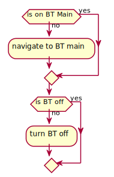

# Bluetooth Service test plan

## Introduction 

The following provides an overview of automatic tests of `ServiceBluetooth` (henceforth referred to as `S-BT`) functionalities form the user perspective (using `HMI` - human control interface). 
Each test may consists of consecutive steps:
* Pre-test device state setup. This includes:
  * `DB` data injection
  * test arguments read
  * proper window navigation  
* Actual device test run
* Post-test device state analysis

The `HMI` interface shall be accessed by `harness` for automation purposes. 
For analyzing content inside displayed windows, the `DOM` functionality shall be used.

## Pre-test device state setup

Each `S-BT` test shall start in `ApplicationSettings:Bluetooth` main window, with `Bluetooth` in turned off state by default. 
This can be achieved by following logic enforcement:

## Testing

### Pairing - happy path 

The test's goal is to ensure that the user can establish `Pure` - `BT` device pair via `HMI`. 

The test inputs:
* external `BT` device name (required)
* external `BT` device password (optional)

### Pairing - no device

The test's goal is to ensure that the user will be correctly notified if the device stored in `DB` 
(the user has paired with the device in the past successfully) cannot be reached at the moment.

### Pairing - forgetting pair

The test's goal is to ensure that the user can make `Pure` forget `BT` devices stored in `DB`.

