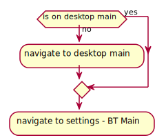
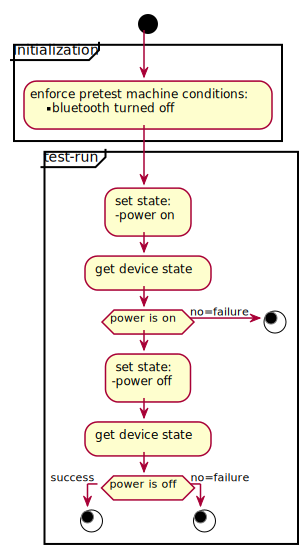
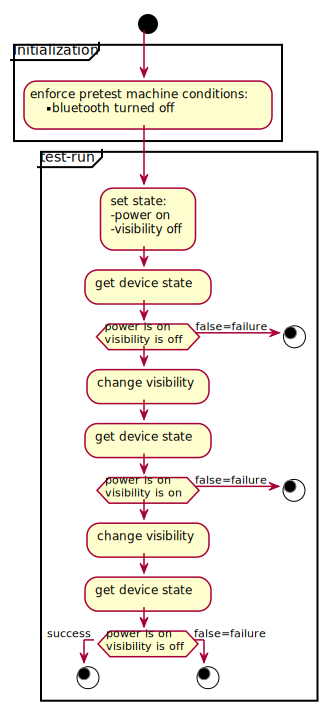
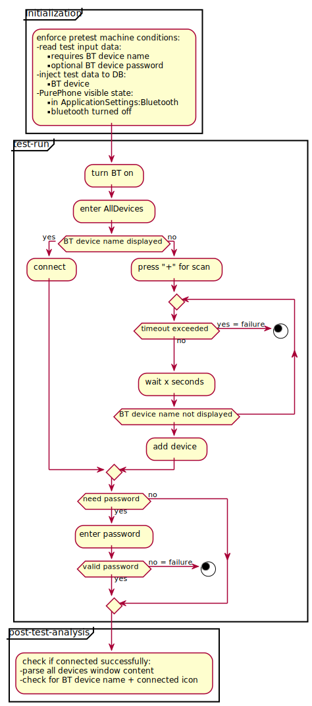

# Bluetooth Service test plan

## Introduction 

The following document provides an overview of automatic tests of `ServiceBluetooth` (henceforth referred to as `S-BT`) functionalities.
Each test may consists of consecutive steps:
* Pre-test device state setup. This includes:
  * `DB` data injection
  * test arguments read
  * proper window navigation  
* Test run on the device
* Post-test device state analysis

Tests shall be grouped (and named respectively) in categories by one of the following `Test run`-step based perspectives:
*  `hmi_perspective` - test is performed in the user perspective (using `HMI` - human-machine interface), allowing tester to 
observe and verify consecutive event handling
* `dev_perspective` - test is performed and analysed using appropriate developer's mode endpoints and the internal system request-response system  

The `HMI` interface shall be accessed by `harness` for automation purposes. 
For analyzing content inside displayed windows, the `DOM` functionality shall be used.

## HMI pre-test device state setup

Each `S-BT` `hmi_perspective` test shall start in `ApplicationSettings:Bluetooth` main window, with `Bluetooth` in turned off state by default. 
This can be achieved by following logic enforcement:

## Testing

### TEST basic_control_dev_perspective - turning `BT` on/off

The test's goal is to ensure that the `BT` device power states can be controlled by `PurePhone` via internal request-response system.

### TEST basic_control_dev_perspective - phone visibility on/off

The test's goal is to ensure that the `BT` device visibility states can be controlled by `PurePhone` via internal request-response system.

### TEST pairing_dev_perspective - pairing

The test's goal is to ensure that the `BT` device pairing ability work, can be controlled by `PurePhone` via internal request-response system. 
Also once a device is paired with the `Pure`, it should stay paired despite turning the `BT` off and on.
The test inputs:
* external `BT` device name (required)

### TEST pairing_dev_perspective - connectivity

The test's goal is to ensure that the `PurePhone` can establish `Pure` - `BT` device connection via internal request-response system.
The test inputs:
* external `BT` device name (required)

### TEST pairing_hmi_perspective - happy path 

The test's goal is to ensure that the user can establish `Pure` - `BT` device pair via `HMI`. 

The test inputs:
* external `BT` device name (required)
* external `BT` device password (optional)

### TEST pairing_hmi_perspective - no device

The test's goal is to ensure that the user will be correctly notified if the device stored in `DB` 
(the user has paired with the device in the past successfully) cannot be reached at the moment.

### TEST pairing_hmi_perspective - forgetting pair

The test's goal is to ensure that the user can make `Pure` forget `BT` devices stored in `DB`.

